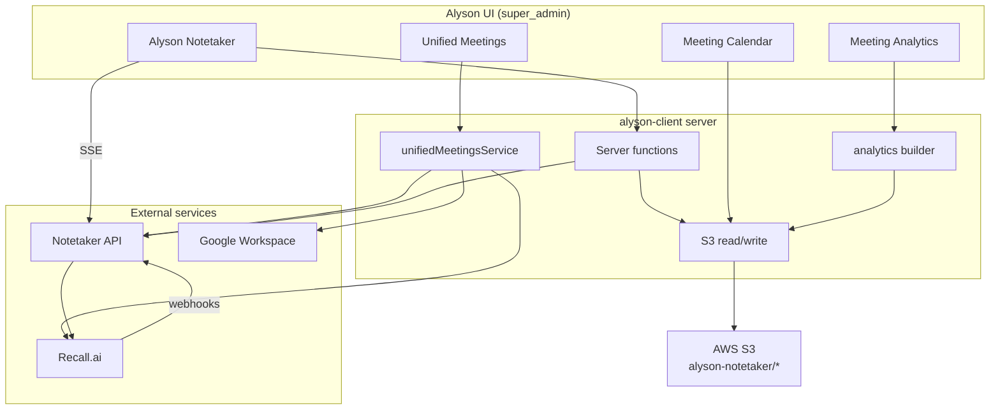
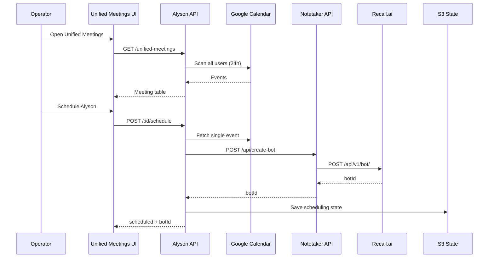

# Alyson Meeting Manager — Complete Guide

**Product:** Alyson HR / Alyson Notetaker  
**Tagline:** *Fireflies-style AI meeting intelligence — built for operators, owned by your company*  
**Audience:** Operators, super-admins, and engineers  
**Last updated:** June 2026  
**Codebase:** `alyson-client` (TanStack Start UI + server functions)

If you have used **Fireflies.ai** (or Otter, Grain, or similar), you already know the pattern: an AI bot joins your call, transcribes it, summarizes it, and lets you search and analyze conversations later. **Alyson Meeting Manager does all of that — and goes further** because it is not a separate SaaS silo. It is the meeting layer inside **Alyson HR**: company-wide calendar visibility, your own S3 archive, speaker analytics tied to your employee directory, and operator-controlled recording policy.

This document explains the system end to end — from calendar discovery to bot scheduling, live transcription, AI notes, long-term storage, and participation analytics — written so you can understand it **like Fireflies**, but see **why Alyson is the better fit** for an internal ops team.

---

## Table of contents

0. [Fireflies-style — but built better](#0-fireflies-style--but-built-better)
1. [What is the Meeting Manager?](#1-what-is-the-meeting-manager)
2. [Who can use it](#2-who-can-use-it)
3. [The four screens](#3-the-four-screens)
4. [Architecture — three runtimes](#4-architecture--three-runtimes)
5. [End-to-end lifecycle](#5-end-to-end-lifecycle)
6. [Module A — Alyson Notetaker (live)](#6-module-a--alyson-notetaker-live)
7. [Module B — Unified Meetings & scheduling](#7-module-b--unified-meetings--scheduling)
8. [Module C — Meeting Calendar](#8-module-c--meeting-calendar)
9. [Module D — Meeting Analytics](#9-module-d--meeting-analytics)
10. [AWS S3 data layout](#10-aws-s3-data-layout)
11. [Transcript format & parsing](#11-transcript-format--parsing)
12. [Speaker identity merging](#12-speaker-identity-merging)
13. [Environment variables](#13-environment-variables)
14. [Local development](#14-local-development)
15. [HTTP API reference](#15-http-api-reference)
16. [CLI analytics crawler](#16-cli-analytics-crawler)
17. [Troubleshooting](#17-troubleshooting)
18. [Known limitations](#18-known-limitations)
19. [Glossary](#19-glossary)
20. [File index](#20-file-index)
21. [Appendix C — Fireflies vs Alyson feature matrix](#appendix-c--fireflies-vs-alyson-feature-matrix)

---

## 0. Fireflies-style — but built better

### The mental model (if you know Fireflies, start here)

Fireflies is a **consumer-grade meeting SaaS**: connect your calendar, the bot auto-joins, transcript lands in their cloud, you get summaries and a searchable library. Alyson follows the **same user story** but optimizes for **company operators** who need control, cost visibility, HR context, and data ownership.

| Fireflies step | What Fireflies does | What Alyson does (better) |
|----------------|---------------------|---------------------------|
| **1. Connect calendar** | Per-user OAuth; each employee connects their own Google/Outlook | **One company scan** via Google Domain-Wide Delegation — see **everyone’s** next-24h meetings in **Unified Meetings** without asking 200 people to click “Connect” |
| **2. Bot joins call** | Auto-join on calendar match (default on) | **Operator chooses** which meetings get Alyson (`Schedule Alyson` per row). Skip rules block OOO/lunch/no-link. **One bot per meeting** deduped across duplicate calendar copies — you do not pay Recall 5× for the same standup |
| **3. Live transcript** | Real-time in Fireflies app | **SSE + 10s poll** in Alyson Notetaker — watch lines arrive during the call, not only after |
| **4. AI summary** | Auto summary + action items | **Generate notes** on demand (Notetaker API + Groq). Large transcripts **chunked locally** so 2-hour calls still get notes |
| **5. Ask AI about meeting** | “AskFred” chat | **In-meeting AI chat** on live transcript context (`askMiniModuleAi`) |
| **6. Meeting library** | Fireflies-hosted search | **Your S3 bucket** — `transcript.txt` + `notes.md` per meeting. You own keys, retention, and access policy |
| **7. Calendar browse** | Fireflies meeting list | **Meeting Calendar** month grid with deep links from analytics |
| **8. Speaker analytics** | Talk-time % per meeting | **Cross-meeting analytics**: pick date range, **All speakers** or named chips, **pick meetings by real title** (fuzzy search), merge duplicate employee emails, export **HTML/PDF**, AI insights |
| **9. HR context** | CRM integrations (Salesforce, etc.) | **Native Alyson HR**: Employee Scoring, Workspace Activity, employee directory identity merge — meetings are part of **how you run the company**, not a bolt-on sales tool |
| **10. Billing** | Per-seat SaaS + opaque usage | **Direct Recall + Groq** — you see bot-hours and AI token costs; no per-employee Fireflies license |

### Why operators pick Alyson over Fireflies

**1. Data stays yours**  
Fireflies stores transcripts on their infrastructure. Alyson writes to **`s3://{your-bucket}/alyson-notetaker/`** with predictable folder names, `bot-index` metadata, and a sessions catalog. Legal, security, and IT can audit exactly where recordings live.

**2. Company-wide visibility, not per-user silos**  
Fireflies is strongest when every attendee has an account and connected calendar. Alyson’s **Unified Meetings** table is an **air traffic control screen** for the whole domain: who has a standup at 10am, which already has a bot scheduled, which was skipped because there is no Meet link.

**3. Governance by design**  
Fireflies defaults to “record everything.” Alyson **disabled bulk auto-schedule** on purpose (see `docs/ALYSON_BOT_SCHEDULING_BLOCKERS.md`). Super-admins **opt in per meeting** until product/legal signs off on wider automation. That is **better for compliance**, not a missing feature.

**4. Smarter analytics for real companies**  
People have `name@company.com` and `name@subsidiary.com`. Fireflies ranks them as two speakers. Alyson **merges identity** against the Google Workspace roster before rollup — rankings reflect **people**, not email aliases.

**5. Better meeting selection**  
Fireflies search is global. Alyson Analytics lets you **multi-select actual meetings** from S3 for the date range, with **fuzzy title search** (`data engineering` matches `Data-Engineering Sync`). No brittle “title contains standup” filter.

**6. Transparent stack**  
Under the hood: **Recall.ai** for the bot, **Groq** for notes/insights, **your S3** for storage. No black box. Engineers can read `notetaker-architecture.md` and fix webhook/SSE issues directly.

**7. Integrated ops workflow**  
One login in Alyson HR → schedule bot → watch live → persist → browse calendar → run analytics → (optionally) correlate with **Employee Scoring** meeting counts. Fireflies requires exporting CSVs and hoping HRIS lines up.

### What Fireflies still has (honest gaps)

We document gaps openly so expectations stay clear:

| Fireflies feature | Alyson status |
|-------------------|---------------|
| Auto-join every calendar meeting | **Intentionally off** — manual per-meeting schedule; cron returns 410 |
| Post-meeting email to attendees | **Not built** |
| CRM auto-push (HubSpot, Salesforce) | **Not built** — HR-native integrations instead |
| Zoom/Teams parity | **Meet-first**; other platforms on calendar may be untested |
| Per-user “don’t record me” toggle | **Not built** — super-admin policy today |
| Mobile app | **Web only** (responsive ops UI) |

For most internal ops teams, **owned data + company calendar + selective recording + HR analytics** beats Fireflies’ convenience features. Email and CRM can be added on top of S3 — you cannot easily pull data *out* of Fireflies’ walled garden.

### The Alyson meeting journey (Fireflies user translation)

```
Fireflies:  Calendar connect → bot auto-joins → email summary next day → search app
Alyson:     Unified Meetings → Schedule Alyson → live Notetaker → auto-save S3
            → Meeting Calendar → Meeting Analytics → export / AI insights
```

---

## 1. What is the Meeting Manager?

The Alyson Meeting Manager is your **in-house Fireflies** — an operations suite for company meetings, embedded in Alyson HR. Super-admins can:

- **Send an AI notetaker bot** into Google Meet calls (via Recall.ai) — same core mechanic as Fireflies’ Fred
- **Discover meetings company-wide** from Google Calendars (Unified Meetings) — broader than per-user Fireflies connect
- **Watch live transcripts** while a meeting runs — real-time ops, not post-hoc only
- **Generate AI meeting notes** after or during a call — Groq-powered, with smart fallback for long calls
- **Persist** transcripts and notes to **your** AWS S3 — not a vendor vault
- **Browse** past meetings on a calendar view — Fireflies-style library, your infrastructure
- **Analyze speaker participation** across many meetings — charts, exports, AI insights, identity-aware rollups

Unlike Fireflies, this system is **not a separate product login**. It lives under the **Operations** menu in Alyson HR alongside Employee Scoring and Workspace Activity. All four meeting screens share one S3 bucket and one notetaker backend.

### Alyson vs Fireflies in one sentence

> **Fireflies is a meeting app you buy; Alyson Meeting Manager is meeting intelligence you operate — with your data, your calendars, and your rules.**

### What it is not

- It is **not** Fireflies-hosted SaaS — transcripts live in **your S3**, bots run through **your Recall account**.
- It is **not** a full video conferencing platform — it joins existing Meet/Zoom links like Fireflies does.
- It does **not** replace Google Calendar — it reads calendars (with DWD) and tracks bot state.
- The **notetaker HTTP API** (webhooks, SSE, Recall proxy) lives in a **separate deployed service** (e.g. Render). This repo (`alyson-client`) is the UI and orchestration layer — the “control plane” Fireflies hides inside their app.

---

## 2. Who can use it?

All Meeting Manager routes require **`super_admin`** role. The gate is enforced in `AppShell` navigation and on the Notetaker page itself.

If you see an empty Ops menu or access errors, confirm your Alyson account has super-admin privileges.

---

## 3. The four screens

Think of these as **four tabs Fireflies wishes it had for enterprise ops** — each screen is a phase of the meeting lifecycle, not a cluttered single inbox.

| Screen | URL | Fireflies equivalent | Why Alyson is better here |
|--------|-----|----------------------|---------------------------|
| **Alyson Notetaker** | `/alyson-notetaker` | Live meeting / notebook view | SSE live lines + in-call AI chat + manual persist to **your** S3 |
| **Unified Meetings** | `/alyson-notetaker/unified-meetings` | Calendar auto-join settings | **Whole-company** 24h radar with skip rules, dedupe, per-meeting schedule |
| **Meeting Calendar** | `/alyson-notetaker/calendar` | Meeting library / notebook | Month grid on **owned storage**; deep links from analytics |
| **Meeting Analytics** | `/alyson-notetaker/analytics` | Conversation intelligence / stats | Cross-meeting speaker rollups, fuzzy meeting picker, identity merge, PDF export |

Alternate URL for Unified Meetings (same UI): `/alyson-notetaker/analytics/unified-meetings`.

### Navigation flow (typical operator)

```
Unified Meetings  →  Schedule Alyson for a meeting
        ↓
Alyson Notetaker  →  Watch live transcript / generate notes
        ↓ (auto or manual persist)
Meeting Calendar  →  Browse saved transcript & notes
        ↓
Meeting Analytics →  Compare speaker participation across meetings
```

---

## 4. Architecture — three runtimes

```
┌─────────────────────────────────────────────────────────────────────────┐
│                         BROWSER (super_admin)                            │
│  /alyson-notetaker  │  /unified-meetings  │  /calendar  │  /analytics │
└───────────────────────────────┬─────────────────────────────────────────┘
                                │ TanStack server functions + REST
                                ▼
┌─────────────────────────────────────────────────────────────────────────┐
│                    ALYSON CLIENT (this repo, port 3001)                  │
│  • Server functions proxy to Notetaker API                                 │
│  • Google Calendar scan (Unified Meetings)                               │
│  • S3 read/write (persist, calendar, analytics)                          │
└───────┬─────────────────────────────┬───────────────────────────────────┘
        │ POST /api/create-bot          │ AWS SDK
        ▼                               ▼
┌───────────────────┐           ┌───────────────────┐
│ NOTETAKER API     │           │ AWS S3 BUCKET     │
│ (Render / :3003)  │           │ alyson-notetaker/*│
│ • Recall proxy    │           └───────────────────┘
│ • Webhooks        │
│ • SSE streams     │
│ • In-memory lines │
└─────────┬─────────┘
          │ POST /api/v1/bot/
          ▼
┌───────────────────┐
│ RECALL.AI         │
│ Bot joins Meet    │
│ Records + STT     │
└───────────────────┘
```

### Responsibility split

| Layer | Owns |
|-------|------|
| **Recall.ai** | Bot in call, recording, built-in transcription, webhooks to Notetaker |
| **Notetaker API** | Create bot, store transcript lines, SSE to browser, session status |
| **Alyson client** | UI, calendar scan, scheduling state, S3 persistence, analytics |
| **S3** | Durable transcripts, notes, indexes, scheduling dedupe state |

---

## 5. End-to-end lifecycle

This is the full journey from a calendar event to analytics.

### Phase 1 — Discovery (Unified Meetings)

1. Operator opens **Unified Meetings**.
2. Server scans **all active Google Workspace users** in `GOOGLE_WORKSPACE_DOMAIN`.
3. For each user, reads **primary calendar** events in the **next 24 hours**.
4. Each event is normalized into a `UnifiedMeeting` row with title, times, Meet URL, attendees, skip reason, bot status.
5. Results are cached for **60 seconds** (auto-refresh in UI).

### Phase 2 — Scheduling (manual per meeting)

1. Operator clicks **Schedule Alyson** (or **Join now** if the meeting is already in progress).
2. Client calls `POST /api/analytics/unified-meetings/:meetingId/schedule`.
3. Server validates: meeting URL exists, join time is valid, dedupe rules pass.
4. **Preferred path:** `POST {NOTETAKER_BASE}/api/create-bot` with `join_at` and metadata.
5. **Fallback path:** Direct `POST {RECALL_BASE}/api/v1/bot/` if Notetaker service fails.
6. Scheduling state saved (`recallBotId`, `botJoinAt`, `creationSource`).
7. Bot registered in **sessions catalog** so it appears in Alyson Notetaker list.

### Phase 3 — Live meeting (Alyson Notetaker)

1. Recall bot joins the Meet at `join_at` (typically **2 minutes before start**).
2. Recall sends **webhooks** to Notetaker API → transcript lines stored in memory.
3. Browser opens **SSE** `GET /session/{botId}/events` for live lines.
4. Browser also **polls** `getNotetakerSession` every **10 seconds** for status + lines.
5. UI merges polled + SSE lines into one transcript view.
6. Operator can **Generate notes** (Groq via Notetaker or client fallback).
7. Operator can use **in-meeting AI chat** over transcript context.

### Phase 4 — Persistence (S3)

Persistence can happen in several ways:

| Trigger | When | What is written |
|---------|------|-----------------|
| **Checkpoint** | During meeting, growing transcript | `transcript.txt` updated, `bot-index` updated |
| **Auto-persist** | Session status = ended | Full transcript + notes + indexes |
| **Manual Persist** | User clicks Persist | Force rewrite + notes regeneration |
| **Background catalog** | Throttled maintenance job | Catches ended upstream sessions before TTL |

S3 folder pattern:

```
alyson-notetaker/transcripts/{title}_{date}_{time}/transcript.txt
alyson-notetaker/meetingnotes/{title}_{date}_{time}/notes.md
alyson-notetaker/bot-index/{botId}.json
```

### Phase 5 — Calendar & Analytics

1. **Meeting Calendar** lists S3 folders by date range; operator opens transcript or notes.
2. **Meeting Analytics** crawls `transcript.txt` files in a date range, parses `Speaker: text` lines, rolls up participation, renders charts.
3. Analytics can **export HTML/PDF** with clickable links back to Calendar.
4. Optional **AI insights** summarize top speakers and patterns (Groq).

> **Fireflies comparison:** Fireflies stops at “search my meetings.” Alyson adds **operator-grade analytics** — filter by real meeting titles, analyze **All speakers** in one click, merge duplicate accounts, and export board-ready PDFs with links back to the canonical transcript in Calendar.

---

## 6. Module A — Alyson Notetaker (live)

> **Fireflies equivalent:** The in-meeting experience + post-meeting notebook.  
> **Why better:** You see the transcript **live** (SSE), chat with AI **during** the call, and choose exactly when to finalize to S3. Fireflies users often wait until processing finishes; Alyson operators can act in real time.

**Route:** `/alyson-notetaker`  
**File:** `src/routes/alyson-notetaker/index.tsx`

### 6.1 Session list

On load, the page calls `listNotetakerSessions()`. The server builds a merged list from:

1. Notetaker API `GET /api/sessions` (live + recent)
2. S3 persisted sessions (`bot-index` + `sessions/index.json`)
3. Unified scheduled bots not yet persisted

Sessions are deduped by `botId`. Background catalog maintenance runs (throttled) to sync ended meetings to S3.

### 6.2 Manual bot creation (`CreateBotForm`)

Operators can send a bot without Unified Meetings:

| Field | Required | Notes |
|-------|----------|-------|
| Meeting URL | Yes | Google Meet link |
| Bot name | No | Defaults to `Alyson Notetaker` |
| Meeting title | No | Display title in UI and S3 |
| Avatar | No | `alyson-mini.svg` converted to JPEG for Recall |

**Code path:**

```
CreateBotForm
  → createNotetakerRecallBot()
  → POST /api/create-bot (Notetaker API)
  → Recall creates bot
  → registerScheduledBotInSessionsCatalog()
```

### 6.3 Live session panel (`SessionPanel`)

When you select a session:

- **SSE stream** connects to `{VITE_ALYSON_NOTETAKER_BASE_URL}/session/{botId}/events`
- **Poll** every 10s via `getNotetakerSession({ botId })`
- **Merged transcript** = union of poll + SSE (deduped by content)
- **Status** shows joining / in_call / ended / error states from upstream

### 6.4 Notes generation

`generateNotetakerNotes({ botId })` calls Notetaker `POST /api/session/:botId/notes`.  
If that fails, client may fall back to `generateSmartMeetingNotes` (Groq in this repo).

**Fireflies parity:** AI summary after the call.  
**Alyson advantage:** Transcripts over ~22k characters use **local chunked summarization** so long executive sessions do not hit upstream token limits — a common Fireflies pain point on 90-minute meetings.

Notes appear in the panel and are included on S3 persist as `notes.md`.

### 6.5 In-meeting AI chat

Uses `askMiniModuleAi` with transcript context from the current session. This is separate from Analytics insights — it is interactive Q&A during the call.

**Fireflies equivalent:** AskFred.  
**Alyson advantage:** Runs against **your** Groq key and **live** merged transcript (poll + SSE), so questions reflect what was just said — not a stale post-processed blob.

### 6.6 Persist & delete

| Action | Function | Effect |
|--------|----------|--------|
| **Persist** | `finalizeAndPersistNotetakerSession` | Writes transcript + notes to S3; updates indexes |
| **Delete** | `deleteNotetakerSessionFromS3` | Removes S3 artifacts (requires super-admin code `75391`) |

After persist, the meeting appears in **Meeting Calendar** and becomes eligible for **Analytics**.

### 6.7 Session title format

Unified-scheduled sessions often use: `DDMMYYYY {meeting title}` (e.g. `05062026 Daily Standup`).  
Manual sessions use the title you provide in the form.

---

## 7. Module B — Unified Meetings & scheduling

> **Fireflies equivalent:** Settings → Auto-join rules + team meeting feed.  
> **Why better:** Fireflies shows *your* meetings after you connect *your* calendar. Unified Meetings shows **the entire company’s** next 24 hours in one table — with explicit skip reasons, bot status, and **one-click schedule** without enabling “record everyone always.”

**Route:** `/alyson-notetaker/unified-meetings`  
**UI file:** `src/routes/alyson-notetaker/analytics.unified-meetings.tsx`  
**Service:** `src/lib/unifiedMeetingsService.ts`

### 7.1 What Unified Meetings shows

A table of **upcoming meetings** (next 24 hours) across the company, with:

- Title, start/end (IST-friendly display)
- Calendar owner email
- Meet link (if any)
- **Should bot join?** (eligibility)
- **Skip reason** (if not eligible)
- **Bot status:** `not_required` | `pending` | `scheduled` | `failed`
- **Recall bot ID** (copyable when scheduled)
- Actions: **Schedule Alyson**, **Join now**, **Redispatch**

### 7.2 Calendar scan mechanics

```
listActiveWorkspaceUsers()
  → for each user:
       calendar.events.list({
         calendarId: "primary",
         timeMin: now,
         timeMax: now + 24h,
         singleEvents: true
       })
  → normalizeMeetingEvent()
  → merge with persisted scheduling state
```

**Requirements:**

- Google Domain-Wide Delegation service account
- Admin impersonation (`GOOGLE_WORKSPACE_ADMIN_SUBJECT_EMAIL`)
- Calendar read scope on the service account
- `GOOGLE_WORKSPACE_DOMAIN` set correctly

### 7.3 Skip rules (meeting will NOT get a bot)

A meeting is skipped when any of these apply:

| Rule | Example |
|------|---------|
| Event cancelled | `status = cancelled` |
| No video link | No `hangoutLink` or Meet entry point |
| Missing start time | All-day events without `dateTime` |
| Event type | `outOfOffice`, `focusTime` |
| Title keywords | "out of office", "ooo", "lunch", "break", "holiday" |
| Start in the past | For eligibility scan window |

Skipped meetings show `botStatus: not_required` and a `skipReason` string.

### 7.4 Dedupe — one bot per meeting occurrence

Multiple employees may have the same Meet on their calendar. The system schedules **one bot per unique**:

```
dedupeKey = meetingUrl + "|" + startTime
```

Not per attendee. This avoids Recall billing for duplicate bots in the same call.

> **Fireflies comparison:** Fireflies may join once per connected user depending on settings; duplicate calendar copies can cause confusion. Alyson’s dedupe key is **explicit and billing-aware** — one standup, one bot, period.

### 7.5 Join timing

| Scenario | `botJoinAt` |
|----------|-------------|
| Future meeting | `startTime - 2 minutes` |
| Meeting starting now / join window open | ~20 seconds from now (Recall needs near-future `join_at`) |
| Meeting ended | Cannot schedule (null join time) |

**Join now** uses the immediate-join path when the meeting is already active.

### 7.6 Bot creation paths

| Path | `creationSource` | Live transcript in Notetaker? |
|------|------------------|-------------------------------|
| Notetaker managed | `notetaker_managed` | Yes (when Notetaker + Recall healthy) |
| Direct Recall fallback | `direct_recall_fallback` | Often **no** — bot exists in Recall but not in Notetaker session list |

Always prefer the Notetaker path for production use.

### 7.7 Scheduling API flow (step by step)

```
1. User clicks "Schedule Alyson" on row with meetingId
2. Browser: POST /api/analytics/unified-meetings/{meetingId}/schedule
3. scheduleUnifiedMeetingById(meetingId)
4. Decode meetingId → calendarUserEmail + googleEventId
5. Fetch single calendar event (fast path, no full rescan)
6. scheduleMeetingInternal()
7. dispatchBotForMeeting()
   a. createNotetakerManagedBot() → POST /api/create-bot
   b. on failure → createRecallBot() → POST Recall /api/v1/bot/
8. writeUnifiedScheduledState() → S3 or local file
9. registerScheduledBotInSessionsCatalog()
10. Return { recallBotId, botJoinAt, botStatus: "scheduled" }
```

**Redispatch:** Append `?redispatch=1` to schedule again (e.g. after failure). Dedupe logic allows replacement when redispatching.

### 7.8 Scheduling state storage

| Storage | Path | When used |
|---------|------|-----------|
| **S3 (production)** | `alyson-notetaker/unified-scheduled/index.json` | `UNIFIED_SCHEDULED_STATE_SOURCE=auto` or `s3` + AWS creds |
| **Local file** | `alyson_scheduled_state.json` | Dev without S3 |
| **Vercel /tmp** | `/tmp/alyson_scheduled_state.json` | Serverless without S3 (ephemeral — **not durable**) |

Each state entry tracks: `dedupeKey`, `googleEventId`, `meetingUrl`, `startTime`, `endTime`, `botJoinAt`, `recallBotId`, `creationSource`, `scheduledAt`, `status`, `lastError`.

### 7.9 Disabled: bulk auto-schedule / cron

`POST /api/analytics/unified-meetings/schedule-bots` returns **410 Gone**.

Previously this endpoint was intended for Vercel cron (every 5 minutes) to auto-schedule all eligible meetings. It is **intentionally disabled** until product signs off on company-wide auto-join policy and billing controls.

**Current policy:** Manual **Schedule Alyson** per meeting only.

> **Why this is better than Fireflies auto-join:** Fireflies optimizes for “never miss a meeting.” Alyson optimizes for **“never surprise a meeting.”** Selective scheduling protects privacy, reduces Recall spend, and lets ops pilot on standups before enabling all-hands. Auto-join can be re-enabled when S3 state durability and billing alerts are production-ready.

See also: `docs/ALYSON_BOT_SCHEDULING_BLOCKERS.md`.

### 7.10 REST endpoints (Unified Meetings)

| Method | Path | Handler |
|--------|------|---------|
| GET | `/api/analytics/unified-meetings` | List meetings (cached scan) |
| POST | `/api/analytics/unified-meetings/refresh` | Force cache refresh |
| POST | `/api/analytics/unified-meetings/:meetingId/schedule` | Schedule one meeting |
| GET/POST | `/api/analytics/unified-meetings/schedule-bots` | **Disabled (410)** |

---

## 8. Module C — Meeting Calendar

> **Fireflies equivalent:** Notebook / meeting list with transcript + summary.  
> **Why better:** Fireflies locks search inside their UI. Alyson Calendar reads **your S3 prefixes** — portable, auditable, and linkable from Analytics exports. IT can lifecycle the bucket; you are not exporting CSVs from a vendor.

**Route:** `/alyson-notetaker/calendar`  
**File:** `src/routes/alyson-notetaker/calendar.tsx`

### 8.1 Purpose

Browse **persisted** meetings from S3 — not live sessions. This is the historical archive view.

### 8.2 How meetings appear on the calendar

1. User selects a **month** (UTC month boundaries).
2. Client calls `listMeetingsFromS3Range({ start, end })`.
3. Server lists S3 common prefixes under:
   - `alyson-notetaker/transcripts/`
   - `alyson-notetaker/meetingnotes/`
4. For each folder prefix, builds a row:

```typescript
{
  prefix: "daily-standup_2026-06-05_14-30-00",
  day: "2026-06-05",
  title: "Daily Standup",        // resolved from bot-index / sessions catalog
  transcriptKey: "alyson-notetaker/transcripts/.../transcript.txt",
  notesKey: "alyson-notetaker/meetingnotes/.../notes.md",
  startedAt: "..."
}
```

5. Meetings grouped by `day` in a month grid.

### 8.3 Opening transcript or notes

Click a meeting → panel loads:

- **Transcript:** `getMeetingTranscriptTextFromS3({ transcriptKey })`
- **Notes:** `getMeetingNotesMdFromS3({ notesKey })`

### 8.4 Deep links from Analytics

Analytics table links open Calendar with search params:

```
/alyson-notetaker/calendar?day=2026-06-05&transcriptKey=alyson-notetaker/transcripts/...&open=transcript
```

Calendar reads these on mount and auto-opens the transcript panel.

### 8.5 Title resolution chain

Display titles are resolved in order:

1. `bot-index/{botId}.json` → `title` field
2. `sessions/index.json` catalog entry
3. Unified scheduled state
4. Parsed from S3 folder prefix (fallback)

---

## 9. Module D — Meeting Analytics

> **Fireflies equivalent:** Conversation intelligence, talk-time, team metrics.  
> **Why better:** Fireflies gives per-meeting talk %. Alyson Analytics runs **across dozens of meetings** with operator filters: **All speakers**, multi-select **real meeting titles**, fuzzy search, **identity merge** for duplicate emails, Groq **AI insights**, and **HTML/PDF export** with calendar deep links — built for HR/ops reviews, not just sales coaching.

**Route:** `/alyson-notetaker/analytics`  
**File:** `src/routes/alyson-notetaker/analytics.tsx`

### 9.1 Purpose

Aggregate **speaker participation** across many finalized meetings using S3 transcripts. This is not live — it analyzes historical `transcript.txt` files.

### 9.2 Filter workflow (important)

Analytics uses an **Apply** pattern — editing filters does not hit S3 until you click **Apply filters**.

| Filter | Behavior | vs Fireflies |
|--------|----------|--------------|
| **Period** | Presets: 7, 15, 30, 45, 60, 90 days — or custom date range (max 365 days) | Similar date ranges; Alyson caps at 365d for predictable S3 crawl cost |
| **Speakers** | **All** (default) or type names as chips (substring / identity match) | Fireflies requires picking people one-by-one; **All** analyzes everyone who spoke in matching meetings |
| **Meetings** | **All** (default) or pick specific meetings from list (by actual title, not keyword) | Fireflies keyword search; Alyson loads **real meetings from S3** and supports **fuzzy title** match |

Meeting picker loads real meetings from S3 for the draft date range. Fuzzy search matches titles (e.g. `data engineering` matches `Data-Engineering Sync`).

Filter state persists in `sessionStorage` (`alyson-notetaker-analytics-session`).

### 9.3 Report generation (server)

`buildNotetakerAnalyticsReport()`:

```
1. listMeetingsFromS3({ start, end })
2. Keep meetings with transcriptKey
3. Optional: filter by meetingPrefixes (selected meetings)
4. Optional: legacy title substring filter
5. Slice to maxMeetings (default 100)
6. For each meeting (concurrency 5):
   a. getTranscriptTextFromS3()
   b. parseTranscriptUtterances()  → lines "Name: text"
   c. resolveCanonicalSpeaker()    → merge duplicate accounts
   d. rollupSpeakers()
   e. Apply speaker filters if any
7. Aggregate global topSpeakers, meetingsByDay, speakerByMeeting
8. Return NotetakerAnalyticsReport
```

### 9.4 Charts & KPIs

| UI element | Data source |
|------------|-------------|
| Meetings in range | All S3 meetings in date range |
| Analyzed (transcript) | Meetings with readable transcript |
| Unique speakers | After identity merge |
| Total utterances | Sum across analyzed meetings |
| Top speakers bar chart | `report.topSpeakers` by utterance count |
| Participation pie | Top 6 speakers vs Others |
| Meetings over time | `report.meetingsByDay` |
| Per-meeting table | `report.meetings` with who spoke |

### 9.5 Speaker identity merge

Employees with multiple emails (e.g. `mohita@revcloud.com` + `mohita@cintara.ai`) are merged using the **Google Workspace employee directory**:

- Same full name → same person
- Same email local-part (`mohita@...`) → same person

Canonical display name is used in charts so one person is not ranked twice.

### 9.6 AI insights

`getNotetakerAnalyticsInsights({ report })` sends a compact JSON summary to Groq and returns markdown insights (top speakers, participation patterns). Requires `ALYSON_MINI_MODULE_AI_API_KEY` or `GROQ_API_KEY`.

### 9.7 Export

| Format | File | Features |
|--------|------|----------|
| HTML | `notetaker-analytics-export.ts` | Talk-time table, clickable meeting links |
| PDF | `notetaker-analytics-pdf.ts` | Printable report with calendar URLs |
| Print | Browser print dialog | Same HTML as export |

### 9.8 Navigation to Calendar

Click a meeting title in the analytics table → confirmation dialog → navigate to Calendar with transcript open.

---

## 10. AWS S3 data layout

> **Fireflies comparison:** Fireflies stores meetings in their multi-tenant cloud. You export when you leave. Alyson’s S3 layout is **designed like a Fireflies notebook export you never have to request** — every meeting is already a folder you control.

All artifacts live under one bucket (`AWS_S3_BUCKET` or `S3_BUCKET`):

```
{bucket}/
└── alyson-notetaker/
    ├── transcripts/
    │   └── {sanitized-title}_{YYYY-MM-DD}_{HH-MM-SS}/
    │       └── transcript.txt
    ├── meetingnotes/
    │   └── {sanitized-title}_{YYYY-MM-DD}_{HH-MM-SS}/
    │       └── notes.md
    ├── bot-index/
    │   └── {url-encoded-botId}.json
    ├── sessions/
    │   └── index.json
    └── unified-scheduled/
        └── index.json
```

### bot-index document (example fields)

```json
{
  "version": 1,
  "botId": "abc-123",
  "title": "Daily Standup",
  "prefix": "daily-standup_2026-06-05_14-30-00",
  "transcriptKey": "alyson-notetaker/transcripts/.../transcript.txt",
  "notesKey": "alyson-notetaker/meetingnotes/.../notes.md",
  "finalizedAt": "2026-06-05T15:00:00Z",
  "lineCount": 142
}
```

### Object metadata

Transcript and notes objects may include:

- `x-amz-meta-bot-id`
- `x-amz-meta-meeting-title`
- `x-amz-meta-started-at`
- `x-amz-meta-ended-at`

---

## 11. Transcript format & parsing

### Storage format

Plain text, one utterance per line:

```
Alice Smith: Good morning everyone.
Bob Jones: Let's review the sprint board.
```

Produced by `composeTranscript()` in `notetaker-persistence.server.ts`.

### Parsing

`parseTranscriptUtterances()` splits on first colon:

```typescript
/^([^:]+):\s*(.+)$/
```

**Caveat:** Speaker names containing colons may parse incorrectly. This is documented in the Analytics UI footer.

### Rollup

`rollupSpeakers()` counts per speaker:

- `utterances` — number of lines
- `words` — word count in utterance text

---

## 12. Speaker identity merging

**Files:** `src/lib/speaker-identity.ts`, `src/lib/speaker-identity.server.ts`

Used by **Meeting Analytics** (and separately by Employee Scoring for a different purpose).

> **Fireflies gap:** Fireflies attributes talk time by detected speaker name/email in the transcript. If the same person joins as `mohita@revcloud.com` and `mohita@cintara.ai`, they appear as **two ranked speakers**. Alyson merges against the **Google Workspace roster** first — rankings reflect **people**, which is what HR actually cares about.

Process:

1. Load employee roster from Google Workspace directory.
2. Cluster emails with same normalized name or same local-part.
3. Pick canonical display name (longest full name).
4. Map all aliases → canonical name before rollup.

UI shows: *"Merged N duplicate accounts"* when merges occurred.

---

## 13. Environment variables

### Notetaker / Recall

| Variable | Used by | Purpose |
|----------|---------|---------|
| `ALYSON_NOTETAKER_BASE_URL` | Server functions | Notetaker API (default `http://localhost:3003`) |
| `VITE_ALYSON_NOTETAKER_BASE_URL` | Browser SSE | **Must match** server URL |
| `RECALL_API_KEY` | Notetaker + fallback | Direct Recall bot create |
| `RECALL_BASE_URL` | Unified fallback | Default `https://ap-northeast-1.recall.ai` |
| `BOT_NAME` | Bot create | Default `Alyson Notetaker` |
| `GROQ_API_KEY` | Notes, insights | AI features |
| `ALYSON_MINI_MODULE_AI_API_KEY` | Analytics insights | Groq for analytics |

### AWS S3

| Variable | Purpose |
|----------|---------|
| `AWS_S3_BUCKET` / `S3_BUCKET` | Bucket name |
| `AWS_REGION` / `S3_REGION` | Region |
| `AWS_ACCESS_KEY_ID` | IAM |
| `AWS_SECRET_ACCESS_KEY` | IAM |
| `NOTETAKER_AUTO_PERSIST_S3` | Default `true`; set `false` to disable auto persist |
| `UNIFIED_SCHEDULED_STATE_SOURCE` | `auto`, `s3`, or `file` |

### Google Workspace (Unified Meetings)

| Variable | Purpose |
|----------|---------|
| `GOOGLE_DWD_SERVICE_ACCOUNT_JSON` | Inline SA JSON (prod) |
| `GOOGLE_APPLICATION_CREDENTIALS` | Path to SA file (dev) |
| `GOOGLE_DWD_SERVICE_ACCOUNT_EMAIL` | SA client email |
| `GOOGLE_WORKSPACE_ADMIN_SUBJECT_EMAIL` | Admin to impersonate |
| `GOOGLE_WORKSPACE_DOMAIN` | e.g. `cintara.ai` |

---

## 14. Local development

### Commands

| Command | Effect |
|---------|--------|
| `npm run dev` | UI on port **3001**, loads `.env` |
| `npm run dev:ops` | Same + forces notetaker URLs to `http://localhost:3003` |

### What you need running

1. **Alyson client** — `npm run dev:ops`
2. **Notetaker API** — separate process on port **3003** (or point env at Render)
3. **AWS credentials** — for S3 persist, calendar, analytics
4. **Google DWD** — for Unified Meetings calendar scan
5. **Recall API key** — on Notetaker service (Render or local)

### SSE port mismatch (common bug)

| Component | Default if env unset |
|-----------|---------------------|
| Server functions | `localhost:3003` |
| Browser SSE | `localhost:3002` |

**Fix:** Set both `ALYSON_NOTETAKER_BASE_URL` and `VITE_ALYSON_NOTETAKER_BASE_URL` to the same value. Use `npm run dev:ops` to set both automatically.

---

## 15. HTTP API reference

### Alyson client REST (Unified Meetings)

Documented in [Section 7.10](#710-rest-endpoints-unified-meetings).

### Notetaker API (external service)

| Method | Path | Called from |
|--------|------|-------------|
| POST | `/api/create-bot` | Manual create, Unified schedule |
| GET | `/api/sessions` | Session list |
| GET | `/api/session/:botId` | Session poll |
| GET | `/session/:botId/events` | Browser SSE only |
| POST | `/api/session/:botId/notes` | Notes generation |

### TanStack server functions (selected)

| Function | Module |
|----------|--------|
| `listNotetakerSessions` | Notetaker |
| `createNotetakerRecallBot` | Notetaker |
| `getNotetakerSession` | Notetaker |
| `finalizeAndPersistNotetakerSession` | Notetaker |
| `listMeetingsFromS3Range` | Calendar |
| `getNotetakerAnalyticsReport` | Analytics |
| `getNotetakerAnalyticsInsights` | Analytics |

---

## 16. CLI analytics crawler

**File:** `scripts/notetaker_analytics_crawler.py`

Offline batch version of the web Analytics screen:

```bash
python scripts/notetaker_analytics_crawler.py --days 30 --max 50 --insights
```

**Environment:** `AWS_REGION`, `AWS_ACCESS_KEY_ID`, `AWS_SECRET_ACCESS_KEY`, `AWS_S3_BUCKET`, optional `GROQ_API_KEY`.

**Options:**

| Flag | Purpose |
|------|---------|
| `--days N` | Look back N days |
| `--speaker NAME` | Filter speakers |
| `--max N` | Max meetings to analyze |
| `--insights` | Run Groq summary |
| `--out FILE` | Write JSON report |

---

## 17. Troubleshooting

### Live transcript empty but bot joined

| Check | Action |
|-------|--------|
| SSE URL | Verify `VITE_ALYSON_NOTETAKER_BASE_URL` matches notetaker service |
| Notetaker health | `GET /api/sessions` should list the bot |
| `creationSource` | Direct Recall fallback may not appear in Notetaker |
| Recall webhooks | `PUBLIC_WEBHOOK_BASE_URL` must be reachable on Notetaker deploy |

### Unified Meetings shows no meetings

| Check | Action |
|-------|--------|
| Google DWD | Service account + domain-wide delegation scopes |
| Domain | `GOOGLE_WORKSPACE_DOMAIN` matches your Workspace |
| Time window | Only **next 24 hours** are scanned |
| Skip rules | Meeting may show `skipReason` |

### Calendar empty but Notetaker had sessions

| Check | Action |
|-------|--------|
| Persist | Meeting must be persisted to S3 (auto or manual) |
| AWS creds | `AWS_S3_BUCKET` and keys valid |
| `NOTETAKER_AUTO_PERSIST_S3` | Not set to `false` |

### Analytics shows 0 analyzed meetings

| Check | Action |
|-------|--------|
| Transcripts | `transcript.txt` must exist in S3 for date range |
| Filters | Click **Apply** after changing filters |
| Meeting picker | Selected meetings must have transcripts |
| maxMeetings | Only first 100 meetings per request |

### Scheduling state lost on Vercel

Use **S3** for unified scheduled state (`UNIFIED_SCHEDULED_STATE_SOURCE=s3`). `/tmp` and local files are ephemeral on serverless.

---

## 18. Known limitations

### Intentional tradeoffs (better than Fireflies for ops)

1. **No company-wide auto-schedule** — cron disabled; manual per-meeting only. *Governance over convenience.*
2. **Super-admin only** — no self-service for regular employees. *Centralized policy vs Fireflies’ everyone-connects-their-calendar sprawl.*
3. **Your infra to operate** — Recall credits, S3, Notetaker deploy. *Transparency and control vs Fireflies’ bundled opaque SaaS fee.*

### Real gaps (Fireflies parity not yet shipped)

4. **No post-meeting email** — Fireflies emails summaries; Alyson persists to S3 (email discussed, not built).
5. **No CRM push** — Fireflies HubSpot/Salesforce; Alyson targets HR (Employee Scoring, Workspace Activity).
6. **No per-user opt-out toggle** — Fireflies has user-level settings; Alyson uses super-admin policy.
7. **24-hour scan window** — Unified Meetings does not show meetings further out (Fireflies shows full connected calendar).
8. **100 meeting analytics cap** — per report request (Fireflies searches entire library).
9. **Speaker colons** — names with `:` break transcript parsing.
10. **Direct Recall fallback** — may lack live transcript in Notetaker UI.
11. **Zoom/Teams** — Meet-first; other platforms may be untested on Recall path.
12. **Notetaker service separate** — webhook/SSE bugs require fixing deployed notetaker, not just this repo.

Full blocker list: `docs/ALYSON_BOT_SCHEDULING_BLOCKERS.md`.

---

## 19. Glossary

| Term | Meaning |
|------|---------|
| **botId** | Recall bot UUID; primary session identifier |
| **prefix** | S3 folder name: `{title}_{date}_{time}` |
| **dedupeKey** | `meetingUrl\|startTime` — one bot per occurrence |
| **creationSource** | `notetaker_managed` or `direct_recall_fallback` |
| **join_at** | ISO time when Recall should join the call |
| **DWD** | Google Domain-Wide Delegation for service accounts |
| **SSE** | Server-Sent Events — live transcript stream |
| **utterance** | One `Speaker: text` line in transcript |
| **canonical speaker** | Merged identity across duplicate emails |
| **Fred / AskFred** | Fireflies’ bot and AI assistant names — Alyson equivalents are **Alyson Notetaker** bot and **in-meeting AI chat** |

### Related Alyson HR modules (beyond Fireflies)

Meeting Manager is not an island. These sibling features use the same Workspace domain and employee identity:

| Module | Route | How it connects to meetings |
|--------|-------|------------------------------|
| **Employee Scoring** | `/employee-scoring` | Meeting counts via calendar API (`accurateMeetings`); identity merge across linked emails |
| **Workspace Activity** | `/workspace-activity` | Per-employee Gmail/Drive/Calendar activity; meeting attendance metrics |
| **Employee drawer** | Team views | Quick path from people records to activity and scoring |

Fireflies cannot replace this layer without a separate HRIS integration project.

---

## 20. File index

### Routes

| Path | File |
|------|------|
| `/alyson-notetaker` | `src/routes/alyson-notetaker/index.tsx` |
| `/alyson-notetaker/calendar` | `src/routes/alyson-notetaker/calendar.tsx` |
| `/alyson-notetaker/analytics` | `src/routes/alyson-notetaker/analytics.tsx` |
| `/alyson-notetaker/unified-meetings` | `src/routes/alyson-notetaker/unified-meetings.tsx` |

### Core libraries

| File | Role |
|------|------|
| `src/lib/unifiedMeetingsService.ts` | Calendar scan, scheduling, dedupe |
| `src/lib/unified-scheduled-s3.server.ts` | Scheduling state persistence |
| `src/lib/alyson-notetaker-functions.ts` | Notetaker proxy functions |
| `src/lib/notetaker-persistence.server.ts` | S3 persist, composeTranscript |
| `src/lib/notetaker-auto-persist.server.ts` | Auto checkpoint + ended persist |
| `src/lib/notetaker-s3-calendar.server.ts` | Calendar S3 listing |
| `src/lib/notetaker-analytics.server.ts` | Analytics report builder |
| `src/lib/notetaker-transcript-parse.server.ts` | Parse & rollup speakers |
| `src/lib/speaker-identity.ts` | Identity merge logic |

### Related documentation

| Document | Topic |
|----------|-------|
| `notetaker-architecture.md` | API flow, Recall billing, code maps |
| `docs/ALYSON_BOT_SCHEDULING_BLOCKERS.md` | Scheduling status & blockers |
| `README.md` | Quick start |

---

## Appendix A — Mermaid: full system



---

## Appendix B — Mermaid: scheduling sequence



---

## Appendix C — Fireflies vs Alyson feature matrix

Use this table when explaining Alyson to someone who already pays for or evaluates Fireflies.

### Core meeting capture

| Capability | Fireflies.ai | Alyson Meeting Manager | Winner for internal ops |
|------------|--------------|------------------------|-------------------------|
| AI bot joins video call | Yes (Meet, Zoom, Teams, Webex) | Yes (Meet-primary via Recall.ai) | Tie on Meet; Fireflies wider platform list today |
| Real-time transcript | Yes | Yes (SSE + poll merge) | **Alyson** — ops dashboard, not rep-facing app |
| Post-meeting transcript | Yes | Yes (`transcript.txt` in S3) | **Alyson** — you own the file |
| AI summary / notes | Auto + templates | On-demand + auto on persist; Groq fallback | Tie; **Alyson** wins on long-call chunking |
| Ask AI about meeting | AskFred | In-meeting chat + analytics insights | Tie |
| Manual send bot to URL | Limited | First-class `CreateBotForm` | **Alyson** for ad-hoc ops |

### Calendar & scheduling

| Capability | Fireflies.ai | Alyson Meeting Manager | Winner for internal ops |
|------------|--------------|------------------------|-------------------------|
| Connect personal calendar | Per-user OAuth | N/A — company DWD scan | Different model |
| See all company meetings | Only if everyone connects | **Unified Meetings** — whole domain 24h | **Alyson** |
| Auto-join all meetings | Default behavior | **Disabled** — manual per meeting | **Alyson** for compliance; Fireflies for convenience |
| Skip OOO / no-link / lunch | Basic rules | Explicit `skipReason` per row | **Alyson** — transparent |
| One bot per duplicate calendar copy | Varies | `meetingUrl\|startTime` dedupe | **Alyson** — billing-safe |
| Join 2 min early | Yes | Yes (`startTime - 2min`) | Tie |
| Scheduling state durability | Fireflies cloud | S3 `unified-scheduled/index.json` (when configured) | **Alyson** when S3 enabled |

### Library & search

| Capability | Fireflies.ai | Alyson Meeting Manager | Winner for internal ops |
|------------|--------------|------------------------|-------------------------|
| Meeting library UI | Notebook, channels, search | **Meeting Calendar** month view | Fireflies richer search UX |
| Data location | Fireflies SaaS | **Your S3 bucket** | **Alyson** |
| Portable export | CSV, integrations | HTML/PDF + raw `.txt`/`.md` in S3 | **Alyson** for raw ownership |
| Deep links between tools | In-app only | Analytics → Calendar URL params | **Alyson** |
| Full-text search index | Built-in | S3 crawl on demand (analytics) | Fireflies today |

### Analytics & intelligence

| Capability | Fireflies.ai | Alyson Meeting Manager | Winner for internal ops |
|------------|--------------|------------------------|-------------------------|
| Talk time / speaker stats | Per meeting + team views | Cross-meeting rollup, charts | **Alyson** for multi-meeting HR reviews |
| Filter by speaker | Yes | **All** button + name chips | **Alyson** |
| Filter by meeting | Keyword / channel | **Picker** from real S3 meetings + fuzzy search | **Alyson** |
| Merge duplicate employee emails | No | Yes (Workspace roster) | **Alyson** |
| AI participation insights | Team analytics | Groq insights on report JSON | Tie |
| Export printable report | Limited | HTML + PDF with calendar links | **Alyson** |
| Offline batch analytics | No | `notetaker_analytics_crawler.py` | **Alyson** |

### HR & company operations

| Capability | Fireflies.ai | Alyson Meeting Manager | Winner for internal ops |
|------------|--------------|------------------------|-------------------------|
| CRM sync (Salesforce, HubSpot) | Yes | Not built | Fireflies for sales |
| HRIS / employee directory | No | Google Workspace roster + identity merge | **Alyson** |
| Employee meeting counts | No | Employee Scoring + Workspace Activity (`accurateMeetings`) | **Alyson** |
| Central super-admin control | Team admin roles | `super_admin` ops gate | **Alyson** for centralized IT |
| Same login as HR platform | No | Alyson HR Operations menu | **Alyson** |

### Cost & architecture

| Capability | Fireflies.ai | Alyson Meeting Manager | Winner for internal ops |
|------------|--------------|------------------------|-------------------------|
| Pricing model | Per-seat SaaS | Recall bot-hours + Groq + S3 (pass-through) | **Alyson** at scale — no per-head tax |
| Stack transparency | Closed | Recall + Groq + S3 + open docs | **Alyson** for engineering |
| Self-host / data residency | No | S3 region of your choice | **Alyson** |
| Webhook + SSE debugging | Opaque | `notetaker-architecture.md` | **Alyson** |

### Summary scorecard

| Persona | Pick Fireflies if… | Pick Alyson if… |
|---------|-------------------|-----------------|
| **Sales team** | You need CRM auto-log and rep self-serve | — |
| **Ops / HR / Engineering** | — | You need company-wide visibility, owned data, selective recording, speaker analytics across meetings, employee identity merge |
| **Compliance** | Vendor SOC2 is enough | You must know exact S3 paths and who authorized each recording |
| **Cost at 200+ employees** | Per-seat adds up fast | You already pay for Google Workspace + want direct Recall/Groq |

### Elevator pitch (copy-ready)

> **Alyson Meeting Manager is what Fireflies would look like if it were built inside your HR platform instead of sold as another subscription.** Same bot-joins-meeting magic. Same AI notes. But your transcripts live in **your S3**, your ops team sees **everyone’s calendar** in one place, you **choose** which meetings get recorded, and analytics understand that **one person can have two emails**. Fireflies optimizes for sales convenience. Alyson optimizes for **how you actually run a company**.

---

*End of document. For questions or updates, edit this file alongside code changes in `src/routes/alyson-notetaker/` and `src/lib/unifiedMeetingsService.ts`.*
