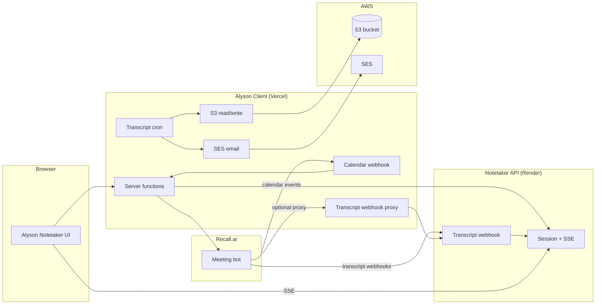
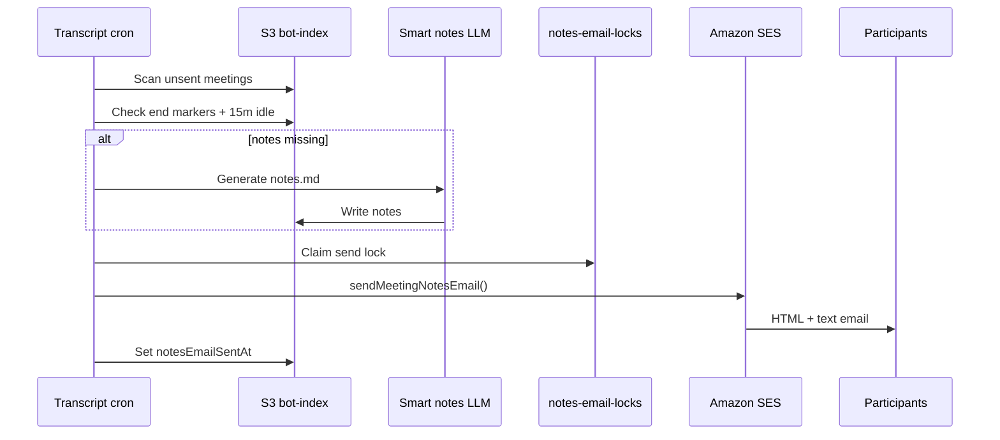
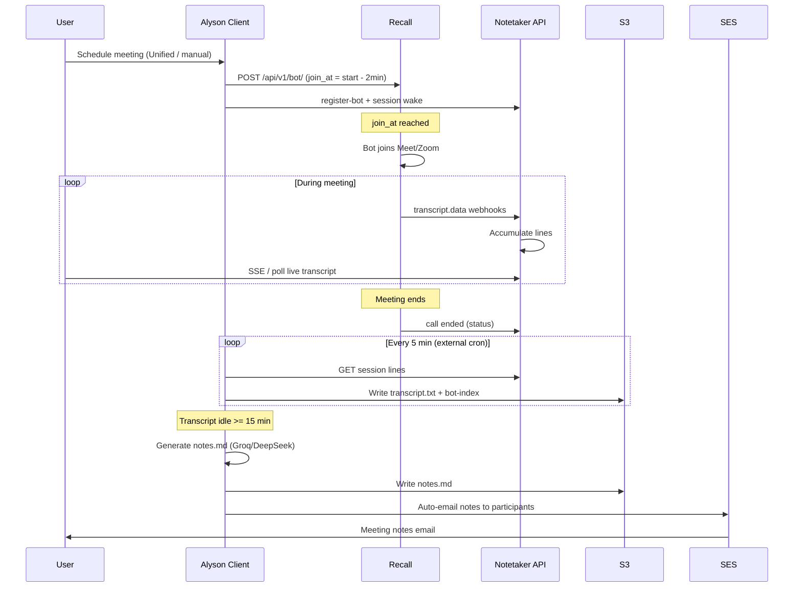

# Alyson Notetaker — Architecture & Operations Guide

This document describes how the Alyson Notetaker system works end-to-end: bot creation, Recall.ai integration, webhooks, hosting, S3 storage, and the automated pipeline for transcripts, smart notes, and email delivery.

**Product handbook (Google Doc):** [Alyson Notetaker handbook](https://docs.google.com/document/d/1C9feKeCFM3j1vPq_YHoICqn8xTdExGaIMQY6h0nEFyQ/edit?tab=t.0)

For module-specific UI docs, see also:

- [ALYSON_NOTETAKER_MODULE.md](./ALYSON_NOTETAKER_MODULE.md)
- [ALYSON_NOTETAKER_S3_READ_WRITE.md](./ALYSON_NOTETAKER_S3_READ_WRITE.md)
- [EXTERNAL_CRON_NOTETAKER.md](./EXTERNAL_CRON_NOTETAKER.md)
- [BOT_JOIN_REPORT_MODULE.md](./BOT_JOIN_REPORT_MODULE.md)

---

## 1. System overview

Alyson Notetaker is a **two-service architecture**:

| Layer | Host | URL | Role |
|-------|------|-----|------|
| **Alyson Client (this repo)** | Vercel | [https://alyson-client.vercel.app](https://alyson-client.vercel.app) | React UI, server functions, crons, webhook receivers, S3 persistence orchestration, SES email |
| **Notetaker backend** | Render | [https://api-uic1.onrender.com](https://api-uic1.onrender.com) | Live session store, SSE stream, Recall transcript webhook handler, bot registration |
| **Recall.ai** | Recall cloud | `https://ap-northeast-1.recall.ai` | Bot joins Google Meet/Zoom, records, streams live transcripts |
| **AWS S3** | AWS | bucket from `AWS_S3_BUCKET` | Durable transcripts, notes, tasks, indexes |
| **AWS SES** | AWS | region from `SES_REGION` / `AWS_REGION` | Meeting notes email delivery |



---

## 2. How a bot is created

There are three main ways a Recall bot gets scheduled.

### 2.1 Manual create (Live Notetaker page)

**Route:** `/alyson-notetaker`

**Flow:**

1. User submits meeting URL + title in the UI.
2. Server function `createNotetakerRecallBot` calls `dispatchBotWithLiveTranscripts()`.
3. Bot is created on Recall with full `recording_config` (transcript webhooks + timed retention).
4. Bot is linked to the Notetaker backend session catalog.
5. Bot joins the meeting at `join_at` (typically **2 minutes before** scheduled start).

**Key file:** `src/lib/notetaker-bot-dispatch.server.ts`

### 2.2 Unified Meetings (per-meeting schedule)

**Route:** `/alyson-notetaker/unified-meetings`

**Flow:**

1. Google Workspace calendar meetings are listed (Domain-Wide Delegation + cached scan).
2. User clicks **Schedule** on a row → `POST /api/analytics/unified-meetings/:meetingId/schedule`.
3. `unifiedMeetingsService` reserves a bot via `dispatchBotWithLiveTranscripts()`.
4. Scheduled state is written to S3 (`unified-scheduled/index.json`).
5. **Unschedule** cancels the Recall bot and removes the S3 row.

**Join timing:** Bot is dispatched with `join_at = meeting_start − 2 minutes`.

**Key file:** `src/lib/unifiedMeetingsService.ts`

### 2.3 Recall Calendar V2 (Google Calendar sync)

**Routes:** `/alyson-notetaker/recall-calendar`, `/alyson-notetaker/unified-meetings` → **Sync now**

**Flow:**

1. Admin connects Google Calendar via OAuth (`/api/recall/calendar/connect`).
2. Recall Calendar V2 watches calendar events.
3. **Sync now** or calendar webhooks trigger `syncRecallCalendarEvents()`.
4. For eligible events, `dispatchBotWithLiveTranscripts()` creates a bot.
5. Connection metadata is stored in S3.

**Key files:**

- `src/lib/recall/recall-calendar-sync.server.ts`
- `src/lib/recall/recall-calendar-service.server.ts`

---

## 3. Bot dispatch — Recall API + Notetaker link

All bot creation paths converge on `dispatchBotWithLiveTranscripts()`.

### Step A — Create bot on Recall (primary path)

```
POST https://ap-northeast-1.recall.ai/api/v1/bot/
Authorization: Token <RECALL_API_KEY>
```

Payload includes:

- `meeting_url`
- `bot_name` (default: `Alyson Notetaker`, from `BOT_NAME`)
- `join_at` (ISO timestamp)
- `recording_config` from `recallBotRecordingConfig()`
- `metadata` (meeting title, webhook URL, join offset, etc.)

**Why Recall-first?** Creating via Recall directly ensures **timed recording retention** (default 48h). The Notetaker `/api/create-bot` path has been observed to leave retention as `forever`, which increases Recall billing after the free window.

### Step B — Link bot to Notetaker backend

After Recall returns a `botId`, `linkBotToNotetakerSession()` runs:

1. **PATCH** Recall bot — re-applies `recording_config` / webhook URL.
2. **POST** `{NOTETAKER_BASE}/api/register-bot` — registers session in Notetaker.
3. **GET** `{NOTETAKER_BASE}/api/session/{botId}` — wakes session (for near-term joins).
4. **S3** — appends bot to `sessions/index.json` via `registerScheduledBotInSessionsCatalog()`.

### Step C — Fallback if Recall fails

If Recall creation fails, the system falls back to:

```
POST {NOTETAKER_BASE}/api/create-bot
```

If both fail, the user sees a combined error.

### Deferred join activation

For bots scheduled far in the future, Notetaker session wake is **deferred** so the bot does not enter the waiting room early. Shortly before `join_at`:

- Cron `/api/cron/scheduled-bot-activation` (every ~2 min, external) calls `activateDueScheduledBotSessions()`.
- ~10 minutes before join, Recall bot recording config is patched (webhook prep).
- At activation window, `linkBotToNotetakerSession()` runs with `allowSessionWake: true`.

---

## 4. Recall recording & transcript configuration

Every bot is created with this recording config (`src/lib/recall/recall-bot-config.server.ts`):

| Setting | Value |
|---------|-------|
| Transcript provider | `recallai_streaming` (low-latency mode) |
| Language | `TRANSCRIPT_LANGUAGE` (default `en`) |
| Recording retention | Timed — `RECALL_RECORDING_RETENTION_HOURS` (default **48h**) |
| Realtime webhook events | `transcript.data`, `transcript.partial_data` |
| Automatic leave | Waiting room timeout 20 min, no-one-joined 20 min, everyone-left 2 min |

Recall keeps media ~7 days on free tier; Alyson copies everything durable to **S3** before Recall deletes media.

---

## 5. Webhooks

### 5.1 Live transcript webhooks (Recall → Notetaker)

| Property | Value |
|----------|-------|
| **Events** | `transcript.data`, `transcript.partial_data` |
| **Configured URL** | See resolution order below |
| **Handler (Notetaker)** | `POST /webhooks/recall/transcript` on Render |
| **Proxy (optional, Vercel)** | `POST /webhooks/recall` → forwards to Notetaker |

**Webhook URL resolution** (`resolveRecallTranscriptWebhookUrl()`):

1. `RECALL_TRANSCRIPT_WEBHOOK_URL` if set explicitly.
2. Else `{ALYSON_APP_BASE_URL}/webhooks/recall` (Vercel proxy).
3. Else `{PUBLIC_WEBHOOK_BASE_URL}/webhooks/recall` if host is Alyson/Vercel.
4. Else `{NOTETAKER_BASE}/webhooks/recall/transcript` (direct to Render).

**Production typical setup:**

- Direct: `https://api-uic1.onrender.com/webhooks/recall/transcript`
- Or proxied: `https://alyson-client.vercel.app/webhooks/recall`

The Vercel proxy (`src/routes/webhooks/recall.ts`) forwards Svix/webhook headers unchanged to Render.

> **Important:** `POST /webhooks/recall` on Render alone returns **404**. The Notetaker path must be `/webhooks/recall/transcript`.

### 5.2 Recall Calendar webhooks (Recall → Vercel)

| Property | Value |
|----------|-------|
| **URL** | `{ALYSON_APP_BASE_URL}/api/recall/webhooks/calendar` |
| **Production** | `https://alyson-client.vercel.app/api/recall/webhooks/calendar` |
| **Verification** | Svix HMAC — `RECALL_CALENDAR_WEBHOOK_SECRET` or `RECALL_VERIFICATION_SECRET` |
| **Handler** | `handleRecallCalendarWebhook()` — syncs calendar events, schedules/cancels bots |

**Key file:** `src/routes/api/recall/webhooks/calendar.ts`

### 5.3 What happens when a transcript webhook arrives

1. Recall POSTs partial/final transcript segments to Notetaker.
2. Notetaker accumulates lines in the live session.
3. Browser polls/SSE: `{NOTETAKER_BASE}/session/{botId}/events`.
4. Alyson Client cron + persist layer periodically checkpoints lines to S3 as `transcript.txt`.

---

## 6. Notetaker backend API (Render)

**Base URL:** [https://api-uic1.onrender.com](https://api-uic1.onrender.com)

Configure in env:

- `ALYSON_NOTETAKER_BASE_URL`
- `VITE_ALYSON_NOTETAKER_BASE_URL`

### Endpoints used by Alyson Client

| Method | Path | Purpose |
|--------|------|---------|
| `GET` | `/api/sessions` | List live/upstream sessions |
| `POST` | `/api/create-bot` | Create bot (fallback path) |
| `POST` | `/api/register-bot` | Adopt existing Recall bot id |
| `GET` | `/api/session/{botId}` | Load session + transcript lines (wake) |
| `GET` | `/session/{botId}/events` | SSE live transcript stream |
| `POST` | `/webhooks/recall/transcript` | Recall live transcript ingestion |

**HTTP client:** `src/lib/notetaker-upstream.server.ts`

Local dev default: `http://localhost:3003` (separate process — not started by `npm run dev`).

---

## 7. Alyson Client hosting (Vercel)

**Production app:** [https://alyson-client.vercel.app](https://alyson-client.vercel.app)

### Cron jobs (`vercel.json`)

| Path | Schedule | Purpose |
|------|----------|---------|
| `/api/cron/notetaker-transcripts` | Daily `0 12 * * *` (noon UTC) | Transcript checkpoint, notes, auto-email sweep |
| `/api/cron/daily-reports` | Daily `30 0 * * *` | Stakeholder daily reports |

> **Vercel Hobby** only allows once-per-day crons. For notes + email ~15 minutes after meetings end, you **must** ping the transcript cron **every 5 minutes** from an external scheduler. See [EXTERNAL_CRON_NOTETAKER.md](./EXTERNAL_CRON_NOTETAKER.md).

**External cron example:**

```http
POST https://alyson-client.vercel.app/api/cron/notetaker-transcripts
Authorization: Bearer <NOTETAKER_TRANSCRIPT_CRON_SECRET or CRON_SECRET>
```

**Optional bot activation cron (every ~2 min):**

```http
POST https://alyson-client.vercel.app/api/cron/scheduled-bot-activation
Authorization: Bearer <CRON_SECRET>
```

### Other notetaker cron routes

| Path | Purpose |
|------|---------|
| `/api/cron/recall-calendar-sync` | Bulk Recall calendar sync |
| `/api/cron/notetaker-meeting-integrity` | Repair duplicate/superseded bot-index docs |
| `/api/cron/scheduled-bot-activation` | Wire Notetaker sessions before deferred joins |

---

## 8. S3 storage — bucket & key layout

All notetaker artifacts live under **`alyson-notetaker/`** in the bucket configured by `AWS_S3_BUCKET` (or `S3_BUCKET`).

**Required env vars:** `AWS_REGION`, `AWS_ACCESS_KEY_ID`, `AWS_SECRET_ACCESS_KEY`, `AWS_S3_BUCKET`

### 8.1 Meeting prefix (join key)

Every meeting gets a shared **prefix**:

```
<sanitized-meeting-title>_<YYYY-MM-DD>_<HH-MM-SS>
```

Example:

```
26082026_Data_Engineering_Team_Daily_Stand-up_2026-08-26_10-30-00
```

This prefix links transcript, notes, and tasks for the same occurrence. Titles are often prefixed with `DDMMYYYY` for recurring meetings.

### 8.2 Core meeting objects

| S3 key | Content | Format |
|--------|---------|--------|
| `alyson-notetaker/transcripts/<prefix>/transcript.txt` | Full meeting transcript | Plain text — `Speaker: utterance` per line |
| `alyson-notetaker/meetingnotes/<prefix>/notes.md` | AI-generated smart notes | Markdown |
| `alyson-notetaker/meetingtasks/<prefix>/tasks.json` | Per-person extracted tasks | JSON (`version`, `people[]`, `sourceHash`, …) |

### 8.3 Indexes & catalog

| S3 key | Content |
|--------|---------|
| `alyson-notetaker/bot-index/<url-encoded-botId>.json` | **Canonical per-bot index** — pointers, hashes, cron state, email state |
| `alyson-notetaker/sessions/index.json` | Fast session list catalog |
| `alyson-notetaker/unified-scheduled/index.json` | Unified Meetings schedule state (bot ids, join times, status) |
| `alyson-notetaker/recall-calendar/connections.json` | Connected Recall calendars + OAuth metadata |
| `alyson-notetaker/notes-email-locks/<botId>.json` | Idempotent SES send lock (prevents double-send) |
| `alyson-notetaker/integrity/latest.json` | Latest meeting integrity audit |
| `alyson-notetaker/integrity/history/<YYYY-MM-DD>.json` | Daily integrity history |

### 8.4 Bot-index document (important fields)

`bot-index/<botId>.json` is the **source of truth** for a meeting:

```jsonc
{
  "version": 1,
  "botId": "...",
  "title": "26082026 [Data Engineering Team] - Daily Stand-up",
  "prefix": "26082026_..._2026-08-26_10-30-00",
  "transcriptKey": "alyson-notetaker/transcripts/<prefix>/transcript.txt",
  "notesKey": "alyson-notetaker/meetingnotes/<prefix>/notes.md",
  "transcriptHash": "...",
  "notesHash": "...",
  "lineCount": 392,
  "wordCount": 8500,
  "finalizedAt": "2026-08-26T11:15:00.000Z",
  "meetingStartedAt": "2026-08-26T10:28:00.000Z",
  "recallCallEndedAt": "2026-08-26T11:00:00.000Z",
  "cronFinalized": true,
  "cronFinalizedAt": "2026-08-26T11:10:00.000Z",
  "transcriptUnchangedSince": "2026-08-26T11:00:00.000Z",
  "notesEmailSentAt": "2026-08-26T11:20:00.000Z",
  "notesEmailRecipients": ["alice@cintara.ai", "thirumalai@cintara.ai"]
}
```

---

## 9. Automated transcript saving

Transcripts are saved to S3 automatically — no manual step required after a meeting.

### 9.1 Live phase (during meeting)

1. Recall streams transcript segments via webhooks → Notetaker.
2. UI polls upstream or uses SSE for live display.
3. Optional checkpoint writes may occur on session load.

### 9.2 Post-meeting persistence (cron-driven)

**Trigger:** `/api/cron/notetaker-transcripts` (every 5 min recommended)

**Pipeline:** `runNotetakerTranscriptCron()` → `driveSessionPersistToS3()` per bot

For each known bot id (upstream sessions + unified schedule + S3 bot-index):

1. Fetch latest transcript lines from Notetaker upstream (or Recall backfill if call ended).
2. Compare content hash — skip if unchanged.
3. Write `transcript.txt` to S3 if changed.
4. Update `bot-index` with `transcriptHash`, `lineCount`, idle markers.
5. Track cron stability — two consecutive identical hashes after call end → `cronFinalized: true`.

**Env:** `NOTETAKER_AUTO_PERSIST_S3=true` (default) — set `false` to disable.

**Key files:**

- `src/lib/notetaker-transcript-cron.server.ts`
- `src/lib/notetaker-session-persist-drive.server.ts`
- `src/lib/notetaker-persistence.server.ts`

### 9.3 Recall backfill

If a meeting ended but S3 transcript is short/empty, cron may call Recall's Retrieve Bot API (throttled — max 8 per cron pass) to backfill missing segments.

---

## 10. Automated smart notes generation

After a meeting ends and the transcript is **stable**, Alyson generates markdown notes via LLM.

### 10.1 When notes are generated

Notes generation runs when:

- Meeting end markers are present (`recallCallEndedAt` or `cronFinalized`), **and**
- Transcript hash has been unchanged for ≥ **`NOTETAKER_NOTES_IDLE_STABLE_MS`** (default **15 minutes**)

This idle window prevents generating notes from a partial in-progress transcript.

### 10.2 How notes are generated

**Function:** `runSmartMeetingNotes()` in `src/lib/notetaker-smart-notes.server.ts`

1. Load full transcript text from live lines or S3.
2. Resolve participant display names (calendar + transcript speakers + employee roster).
3. Call AI:
   - **Primary:** Groq (`GROQ_API_KEY`)
   - **Fallback:** DeepSeek (`DEEPSEEK_API_KEY`)
4. Output structured Markdown sections: Summary, Decisions, Action items, Risks/blockers, Open questions.
5. Write `notes.md` to S3 and update `bot-index.notesKey` / `notesHash`.

**Trigger paths:**

- Transcript cron → `driveSessionPersistToS3()` → `maybeAutoSendMeetingNotesEmail()` (generates notes if missing)
- Auto-persist on session finalize
- Manual "Generate notes" in UI
- Backfill scripts / admin tools

### 10.3 Tasks (optional follow-on)

When notes + transcript exist, Meeting List may generate `tasks.json` (per-person action items) via `notetaker-meeting-list-tasks.server.ts`. Tasks are cached in S3 with a `sourceHash` tied to notes/transcript content.

---

## 11. Automated email of notes to audience

After notes are ready, Alyson can automatically email them to meeting participants via **Amazon SES**.

### 11.1 Enable / disable

| Env var | Default | Effect |
|---------|---------|--------|
| `NOTETAKER_NOTES_AUTO_EMAIL` | `true` | Set `false` to generate notes but skip SES |
| `AWS_ACCESS_KEY_ID` + `AWS_SECRET_ACCESS_KEY` | required | SES credentials |
| `SES_FROM_EMAIL` | `notetaker@cintara.ai` | From address |
| `SES_FROM_NAME` | `Alyson Notetaker` | Display name |
| `ALYSON_APP_BASE_URL` | Vercel app URL | Deeplink in email body |

### 11.2 Email pipeline

**Function:** `maybeAutoSendMeetingNotesEmail()` → `sweepAutoSendMeetingNotesEmails()`

**File:** `src/lib/notetaker-meeting-notes-auto-email.server.ts`



**Eligibility (any of):**

1. Meeting end markers present + transcript idle ≥ 15 min
2. **Notes-ready catch-up** — notes already on S3, transcript idle ≥ 15 min (even without end markers)
3. **Stale fallback** — unsent for ≥ 1 hour (`NOTETAKER_NOTES_EMAIL_STALE_FALLBACK_MS`)

**Idempotency:**

- S3 lock at `alyson-notetaker/notes-email-locks/<botId>.json`
- `bot-index.notesEmailSentAt` set after successful send
- Manual send from UI also marks sent — auto-email never double-sends

**Sweep limit:** Max **20 emails per cron pass** (`MAX_AUTO_EMAILS_PER_SWEEP`).

### 11.3 Who receives the email

**Function:** `resolveMeetingNotesRecipientEmails()` in `src/lib/meeting-notes-email.server.ts`

Recipients are resolved from:

1. **Calendar attendees** (Google/Recall event)
2. **Transcript speakers** (mapped via employee roster + speaker identity index)
3. Allowed domains: `@cintara.ai`, `@revcloud.com`, `@betterpeoplesupport.com`
4. **Monitor copy:** `thirumalai@cintara.ai` is always included for QA

Email includes:

- Subject from meeting title + date
- HTML body from markdown notes
- Deeplink to transcript/notes in Alyson app

---

## 12. End-to-end lifecycle (typical meeting)



---

## 13. Environment variables reference

### Notetaker backend

| Variable | Example | Purpose |
|----------|---------|---------|
| `ALYSON_NOTETAKER_BASE_URL` | `https://api-uic1.onrender.com` | Notetaker API base |
| `VITE_ALYSON_NOTETAKER_BASE_URL` | same | Browser-visible base (if needed) |
| `PUBLIC_WEBHOOK_BASE_URL` | `https://api-uic1.onrender.com` | Legacy webhook base hint |

### Recall.ai

| Variable | Example | Purpose |
|----------|---------|---------|
| `RECALL_API_KEY` | *(secret)* | Recall API auth |
| `RECALL_BASE_URL` | `https://ap-northeast-1.recall.ai/api/v2` | Recall API host |
| `RECALL_REGION` | `ap-northeast-1` | Region |
| `RECALL_CALENDAR_ID` | UUID | Default calendar connection |
| `RECALL_TRANSCRIPT_WEBHOOK_URL` | Render transcript webhook URL | Explicit webhook override |
| `RECALL_RECORDING_RETENTION_HOURS` | `48` | Timed media retention |
| `RECALL_VERIFICATION_SECRET` | *(secret)* | Webhook signature verification |
| `TRANSCRIPT_LANGUAGE` | `en` | Streaming transcript language |

### S3 & automation

| Variable | Default | Purpose |
|----------|---------|---------|
| `AWS_S3_BUCKET` | — | S3 bucket name |
| `NOTETAKER_AUTO_PERSIST_S3` | `true` | Auto transcript checkpoint |
| `NOTETAKER_NOTES_IDLE_STABLE_MS` | `900000` (15 min) | Idle before notes + email |
| `NOTETAKER_NOTES_AUTO_EMAIL` | `true` | Auto SES after notes |
| `NOTETAKER_TRANSCRIPT_CRON_ENABLED` | — | Enable transcript cron route |
| `NOTETAKER_TRANSCRIPT_CRON_SECRET` | — | Bearer auth for cron |

### Email (SES)

| Variable | Default | Purpose |
|----------|---------|---------|
| `SES_FROM_EMAIL` | `notetaker@cintara.ai` | From address |
| `SES_FROM_NAME` | `Alyson Notetaker` | From display name |
| `SES_REGION` | falls back to `AWS_REGION` | SES region |

### AI (notes)

| Variable | Purpose |
|----------|---------|
| `GROQ_API_KEY` | Primary notes LLM |
| `DEEPSEEK_API_KEY` | Fallback notes LLM |

### App URLs

| Variable | Production value |
|----------|------------------|
| `ALYSON_APP_BASE_URL` | `https://alyson-client.vercel.app` |

See `env.production.example` for the full Vercel production checklist.

---

## 14. UI routes map

| Route | Purpose |
|-------|---------|
| `/alyson-notetaker` | Live bot control + transcript |
| `/alyson-notetaker/meeting-list` | S3-backed meeting index + tasks |
| `/alyson-notetaker/calendar` | Day/month view of notes/transcripts |
| `/alyson-notetaker/unified-meetings` | Schedule bots per calendar meeting |
| `/alyson-notetaker/recall-calendar` | Recall Calendar OAuth + sync |
| `/alyson-notetaker/bot-join-report` | Did bots join scheduled meetings? |
| `/alyson-notetaker/analytics` | Usage analytics |
| `/alyson-notetaker/cost-tracking` | Recall cost report |
| `/alyson-notetaker/transcript` | Transcript viewer (deeplink target) |
| `/alyson-notetaker/notes` | Notes viewer (deeplink target) |

---

## 15. Key source files

| Area | File |
|------|------|
| Bot dispatch | `src/lib/notetaker-bot-dispatch.server.ts` |
| Recall bot config | `src/lib/recall/recall-bot-config.server.ts` |
| Transcript webhook proxy | `src/routes/webhooks/recall.ts` |
| Calendar webhook | `src/routes/api/recall/webhooks/calendar.ts` |
| Calendar sync | `src/lib/recall/recall-calendar-sync.server.ts` |
| Notetaker HTTP client | `src/lib/notetaker-upstream.server.ts` |
| Transcript cron | `src/lib/notetaker-transcript-cron.server.ts` |
| S3 persist | `src/lib/notetaker-persistence.server.ts` |
| Auto persist + notes | `src/lib/notetaker-auto-persist.server.ts` |
| Smart notes LLM | `src/lib/notetaker-smart-notes.server.ts` |
| Auto email | `src/lib/notetaker-meeting-notes-auto-email.server.ts` |
| Email recipients + SES | `src/lib/meeting-notes-email.server.ts` |
| S3 calendar/list reads | `src/lib/notetaker-s3-calendar.server.ts` |
| Unified schedule | `src/lib/unifiedMeetingsService.ts` |
| Scheduled bot activation | `src/lib/notetaker-scheduled-bot-activation.server.ts` |

---

## 16. Operational notes

### External cron is required for timely emails

Vercel native cron runs **once per day**. Without an external 5-minute ping, transcripts/notes/email may lag until the daily run. See [EXTERNAL_CRON_NOTETAKER.md](./EXTERNAL_CRON_NOTETAKER.md).

### Cron timeout

The transcript cron scans hundreds of bots and may hit Vercel's **~5 minute** function timeout. The sweep still processes up to 20 auto-emails per pass; consider external cron frequency + timeout monitoring.

### Clearing stuck unsent emails

One-shot script (local):

```bash
dotenv -e .env -- npx tsx tmp/send-stuck-notes-emails.ts
```

### Recall media cleanup

After S3 persist is stable, cron may call Recall `delete_media` (~48h after meeting) to reduce Recall storage costs. Tracked via `bot-index.recallMediaDeletedAt`.

---

## 17. Quick reference links

| Resource | URL |
|----------|-----|
| Alyson Client (production) | [https://alyson-client.vercel.app](https://alyson-client.vercel.app) |
| Notetaker API (Render) | [https://api-uic1.onrender.com](https://api-uic1.onrender.com) |
| Recall.ai dashboard | [https://ap-northeast-1.recall.ai](https://ap-northeast-1.recall.ai) |
| Transcript cron (external) | `POST https://alyson-client.vercel.app/api/cron/notetaker-transcripts` |
| Calendar webhook | `POST https://alyson-client.vercel.app/api/recall/webhooks/calendar` |
| Transcript webhook (direct) | `POST https://api-uic1.onrender.com/webhooks/recall/transcript` |
| Transcript webhook (proxy) | `POST https://alyson-client.vercel.app/webhooks/recall` |

---

*Last updated: August 2026 — reflects `alyson-client` on Vercel + Notetaker on Render + Recall Calendar V2.*
