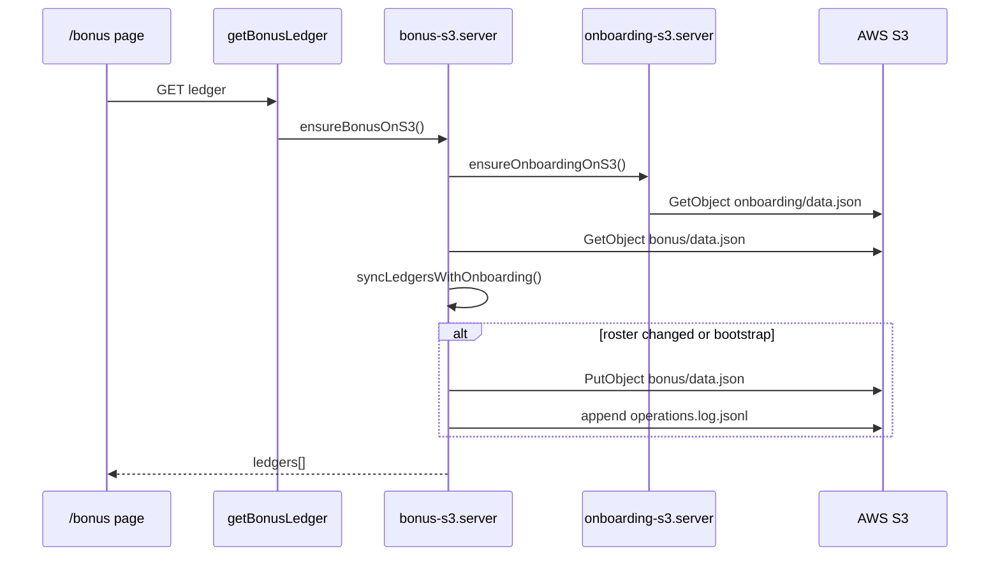
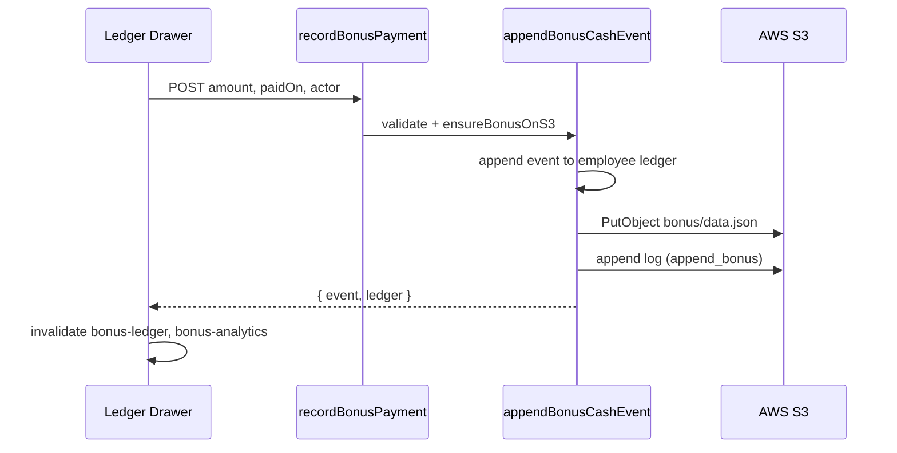

# Bonus Module Documentation

This document explains the Bonus & Shares module end-to-end:

- architecture and routes
- data model and S3 persistence
- onboarding roster sync
- cash bonus and share event flows
- analytics and audit logging
- permissions, legacy demo routes, and file map

---

## 1) Purpose

The Bonus module (`/bonus`) tracks **per-employee compensation events**:

- **Cash bonuses** — append-only payment records with amount, paid date, and optional period label
- **Share/equity events** — grants, vests, adjustments, and notes

It is an **S3-backed ledger** synced from **Employee Onboarding** for roster identity (name, email, team, location, job title). Payment history is append-only at the event level; voiding removes an event from the live ledger but keeps a snapshot in the audit log.

Nav label: **Bonus & Shares** (Money group).

---

## 2) Route Structure

Parent layout:

| File | Path | Component |
|------|------|-----------|
| `src/routes/bonus/route.tsx` | `/bonus` | `BonusLayout` |

Active child routes (linked from layout tabs):

| File | Path | Purpose |
|------|------|---------|
| `src/routes/bonus/index.tsx` | `/bonus` | Employee ledger table + drawer |
| `src/routes/bonus/analytics.tsx` | `/bonus/analytics` | Charts and bonus spend analytics |
| `src/routes/bonus/audit.tsx` | `/bonus/audit` | Append-only operations log viewer |

### Legacy / demo routes (not in main tabs)

These routes exist but use **mock in-memory data** and are **not** wired to S3:

| File | Path | Status |
|------|------|--------|
| `src/routes/bonus/plans.tsx` | `/bonus/plans` | Mock bonus plans (`MOCK_PLANS`) |
| `src/routes/bonus/simulate.tsx` | `/bonus/simulate` | Mock allocation simulator (`bonus/engine.ts`) |
| `src/routes/bonus/approvals.tsx` | `/bonus/approvals` | Mock approval workflow (`MOCK_APPROVALS`) |

The production bonus product surface is **Employees + Analytics + Audit**.

---

## 3) Access Control

### Layout gate (`bonus/route.tsx`)

```ts
canView = hasAnyRole(["super_admin", "ceo"])
```

Non-authorized users see Access Denied.

### Edit permissions (child pages)

```ts
canEdit = hasAnyRole(["super_admin", "ceo"])
```

- Record bonus / share events
- Void events (with typed confirmation in drawer)
- Sync onboarding roster

### Audit log visibility

- All viewers with module access see operation metadata.
- **Super Admin only** sees full serialized `event` JSON payloads in the audit table.

### Nav vs route mismatch

`AppShell.tsx` nav item includes `finance`, `hr`, `manager` roles, but the `/bonus` layout only allows `super_admin` and `ceo`. Users with finance/hr/manager may see nav but get Access Denied on the route until guards are aligned.

---

## 4) Data Model

Schema file: `src/lib/bonus-schema.ts`

### Employee ledger (`EmployeeCompensationLedger`)

| Field | Type | Description |
|-------|------|-------------|
| `employeeId` | string | From onboarding Employee ID |
| `employeeName` | string | Display name |
| `officialEmail` | string | Work email |
| `jobTitle` | string | From onboarding |
| `team` | string | From onboarding |
| `location` | string | From onboarding |
| `active` | boolean | `false` when removed from onboarding roster |
| `bonusEvents` | `BonusCashEvent[]` | Cash payment history |
| `shareEvents` | `ShareEvent[]` | Equity event history |
| `updatedAt` | string | ISO timestamp |

### Cash bonus event (`BonusCashEvent`)

| Field | Type | Description |
|-------|------|-------------|
| `id` | string | `bonus_{timestamp}_{random}` |
| `amountUsd` | number | Positive USD amount |
| `paidOn` | string | `YYYY-MM-DD` |
| `periodLabel` | string? | e.g. `Jan 2026`, `Q1 2026` |
| `note` | string? | Free text |
| `createdAt` | string | ISO timestamp |
| `createdBy` | string? | Actor email |

### Share event (`ShareEvent`)

| Field | Type | Description |
|-------|------|-------------|
| `id` | string | `share_{timestamp}_{random}` |
| `eventType` | enum | `grant` \| `vest` \| `adjustment` \| `note` |
| `shares` | number | Share count (can be negative for adjustment) |
| `effectiveDate` | string | `YYYY-MM-DD` |
| `strikePriceUsd` | number? | Optional strike price |
| `note` | string? | Free text |
| `createdAt` | string | ISO timestamp |
| `createdBy` | string? | Actor email |

### Helpers

- `sumBonusEvents(events)` — lifetime cash total
- `sumShareGrants(events)` — sum of `grant` + `adjustment` share counts
- `periodLabelFromIso(iso)` — auto period label from paid date

### S3 data file (`BonusDataFile`)

```json
{
  "version": 1,
  "updatedAt": "2026-07-02T10:00:00.000Z",
  "syncedFromOnboardingAt": "2026-07-01T08:00:00.000Z",
  "employees": {
    "emp_123": { /* EmployeeCompensationLedger */ }
  }
}
```

---

## 5) S3 Storage Layout

Implementation: `src/lib/bonus-s3.server.ts`

### Environment variables

| Variable | Default | Purpose |
|----------|---------|---------|
| `AWS_REGION` / `S3_REGION` | required | S3 client region |
| `AWS_ACCESS_KEY_ID` | required | Credentials |
| `AWS_SECRET_ACCESS_KEY` | required | Credentials |
| `ALYSON_HR_ORGCHART_S3_BUCKET` | `alyson-hr-orgchart` | Shared HR bucket |
| `ALYSON_HR_BONUS_S3_KEY` | `bonus/data.json` | Ledger snapshot |
| `ALYSON_HR_BONUS_LOG_S3_KEY` | `bonus/operations.log.jsonl` | Audit log |

### Object paths

```
s3://{bucket}/bonus/data.json
s3://{bucket}/bonus/operations.log.jsonl
```

Same bucket as onboarding and leave (`alyson-hr-orgchart` by default).

---

## 6) Server Function Layer

File: `src/lib/bonus-functions.ts`

All handlers use TanStack `createServerFn` with Zod validation.

| Function | Method | Purpose |
|----------|--------|---------|
| `getBonusLedger` | GET | Load ledgers (auto-sync onboarding) |
| `syncBonusWithOnboarding` | POST | Force roster reconcile |
| `recordBonusPayment` | POST | Append cash bonus event |
| `recordShareEvent` | POST | Append share event |
| `voidBonusPayment` | POST | Remove bonus event by ID |
| `voidShareEvent` | POST | Remove share event by ID |
| `getBonusAnalytics` | GET | Build analytics report |
| `getBonusAuditLog` | GET | Read last N log entries |

---

## 7) Onboarding Sync (Roster Source)

**Bonus employee list comes from Employee Onboarding, not Time Doctor or Team directory.**

On every `ensureBonusOnS3()` call:

1. `ensureOnboardingOnS3()` loads onboarding roster from S3.
2. `syncLedgersWithOnboarding(onboardingRows, existingLedgers)` merges:
   - **New onboarding rows** → create ledger shells (empty event arrays).
   - **Existing rows** → refresh name, email, team, location, job title; preserve `bonusEvents` / `shareEvents`.
   - **Rows no longer in onboarding** → mark `active: false` (history retained).

3. If bootstrap or roster metadata changed → rewrite `bonus/data.json` with `op: bootstrap|sync`.

Manual sync: **Sync onboarding** button on `/bonus` calls `syncBonusWithOnboarding`.

---

## 8) Read Flow

```
BonusEmployeesPage
  useQuery(["bonus-ledger"], getBonusLedger)
    ↓
  ensureBonusOnS3()
    ↓
  ensureOnboardingOnS3() + merge ledgers
    ↓
  return { ledgers[], bucket, key, updatedAt, syncedFromOnboardingAt }
```

UI filters:

- Text search (name, email, team, location, employee ID)
- **Active employees only** checkbox (default on)

Summary cards (filtered):

- Employee count
- Lifetime bonuses (filtered)
- Share grants (filtered)

---

## 9) Write Flows

### Record cash bonus

```
BonusEmployeeLedgerDrawer (Bonus tab)
  → recordBonusPayment({ employeeId, amountUsd, paidOn, periodLabel?, note?, actor })
  → appendBonusCashEvent()
  → putBonusToS3 + appendBonusLog (op: append_bonus)
```

Validation:

- `amountUsd` must be positive
- `paidOn` must match `YYYY-MM-DD`
- Employee must exist in ledger

### Record share event

```
Drawer (Shares tab)
  → recordShareEvent({ employeeId, eventType, shares, effectiveDate, strikePriceUsd?, note?, actor })
  → appendShareLedgerEvent()
  → putBonusToS3 + appendBonusLog (op: append_share)
```

Event types: `grant`, `vest`, `adjustment`, `note`.

### Void bonus or share

```
Drawer (History tab) → typed confirmation dialog
  → voidBonusPayment / voidShareEvent
  → filter event from ledger array
  → putBonusToS3 + appendBonusLog (op: void_bonus | void_share)
  → removed event snapshot stored in log entry
```

Void is a **ledger correction**, not a silent delete — audit log retains the removed event payload.

---

## 10) Analytics

Files:

- `src/lib/bonus-analytics.ts` — report builder
- `src/routes/bonus/analytics.tsx` — charts UI

### Report generation

`getBonusAnalytics()` → `buildBonusAnalyticsReport(ledgers, updatedAt)`:

1. Flatten all `bonusEvents` across ledgers into `BonusPaymentFact[]`.
2. Aggregate by team, location, month, week, day.
3. Compute top recipients and recent payments.

### Client-side filters (`filterBonusAnalytics`)

- Team
- Location
- Active employees only

### Charts (Recharts)

- Bonus over time (daily / weekly / monthly granularity)
- By team (pie + bar)
- By location (bar)
- Top recipients table
- Recent payments table

Polling: `refetchInterval: 30_000`, `staleTime: 15_000`.

**Note:** Analytics currently covers **cash bonuses only**, not share/equity events.

---

## 11) Audit Logging

Every `putBonusToS3` appends one JSONL line via `appendBonusLog()`.

### Operations (`BonusOperation`)

| Op | When |
|----|------|
| `bootstrap` | First ledger creation from onboarding |
| `sync` | Roster reconcile with onboarding |
| `append_bonus` | Cash payment recorded |
| `append_share` | Share event recorded |
| `void_bonus` | Cash payment removed |
| `void_share` | Share event removed |

### Log entry fields

`ts`, `op`, `actor`, `employeeId`, `employeeName`, `details`, `event` (full snapshot), `employeeCount`

Viewer: `/bonus/audit` via `getBonusAuditLog(300)` — last 300 entries, newest first.

---

## 12) UI Components

### `BonusEmployeeLedgerDrawer`

File: `src/components/BonusEmployeeLedgerDrawer.tsx`

Tabs:

1. **History** — sorted bonus + share events, void actions with typed confirm
2. **Record bonus** — amount, paid date, note (auto `periodLabel` from date)
3. **Record shares** — type, count, effective date, strike price, note

Shows lifetime bonus total and share grant total in header.

### Employees table (`/bonus`)

Columns: Employee, Team, Location, Bonuses paid, # Payments, Share grants, Last bonus, Status, View ledger.

---

## 13) Legacy Demo Subsystem

Separate from S3 ledger — useful for prototyping only:

| File | Role |
|------|------|
| `src/lib/bonus/mock.ts` | `MOCK_PLANS`, `MOCK_EMPLOYEES`, `MOCK_APPROVALS` |
| `src/lib/bonus/engine.ts` | `allocateBonus`, `normalizeInputs` pool math |
| `src/lib/bonus/types.ts` | Simulation input types |
| `src/lib/bonus/trends.ts` | Trend helpers for mock views |

These routes are **not** linked from the main Bonus layout tabs.

---

## 14) Query Invalidation

Mutations invalidate dependent caches:

| Mutation | Invalidated keys |
|----------|------------------|
| Sync onboarding | `bonus-ledger`, `bonus-analytics` |
| Record bonus/share | `bonus-ledger`, `bonus-analytics` |
| Void bonus/share | `bonus-ledger`, `bonus-audit-log`, `bonus-analytics` |

---

## 15) Failure Handling

| Failure | Behavior |
|---------|----------|
| Missing AWS env | Server throws explicit missing env error |
| Employee not in ledger | `Employee not found in bonus ledger` |
| Event not found on void | `Bonus payment not found` / `Share event not found` |
| S3 missing on first read | Bootstrap from onboarding roster |
| Mutation error | Toast with error message |

No optimistic concurrency (ETag) on bonus S3 — last write wins.

---

## 16) Integration Map

```text
Employee Onboarding (S3)
        │
        ▼ syncLedgersWithOnboarding()
Bonus Ledger (S3: bonus/data.json)
        │
        ├── /bonus (employee table + drawer)
        ├── /bonus/analytics (cash bonus charts)
        └── /bonus/audit (operations log)

NOT connected:
  - Team directory (RevCloud/S3 overview)
  - Time Doctor
  - Supabase bonus_plans / bonus_awards (legacy queries-ext still exists for old screens)
```

`queries-ext.ts` still has `fetchBonusPlans()` and `fetchBonusAwards()` for Supabase — the **current `/bonus` module does not use these**; it uses the S3 ledger path instead.

---

## 17) Sequence Diagrams

### Page load with auto-sync



### Record bonus payment



---

## 18) File Map

| File | Role |
|------|------|
| `src/routes/bonus/route.tsx` | Layout, access gate, tabs |
| `src/routes/bonus/index.tsx` | Employee ledger page |
| `src/routes/bonus/analytics.tsx` | Analytics charts |
| `src/routes/bonus/audit.tsx` | Audit log viewer |
| `src/lib/bonus-functions.ts` | Server function API |
| `src/lib/bonus-s3.server.ts` | S3 read/write, onboarding sync |
| `src/lib/bonus-schema.ts` | Types and sum helpers |
| `src/lib/bonus-analytics.ts` | Report builder + filters |
| `src/components/BonusEmployeeLedgerDrawer.tsx` | Per-employee CRUD drawer |
| `src/lib/bonus/mock.ts` | Legacy demo data |
| `src/lib/bonus/engine.ts` | Legacy simulation engine |
| `src/routes/bonus/plans.tsx` | Legacy mock plans page |
| `src/routes/bonus/simulate.tsx` | Legacy simulator page |
| `src/routes/bonus/approvals.tsx` | Legacy mock approvals page |

---

## 19) Migration Notes (Palisade merge)

When porting to another repo:

1. **Preserve** `bonus-schema.ts`, `bonus-s3.server.ts`, `bonus-analytics.ts`.
2. **Adapt** `bonus-functions.ts` to target API pattern if not using TanStack Start.
3. **Keep S3 keys** or migrate `bonus/data.json` + log deliberately.
4. **Rebuild UI** with target design system; drawer/table patterns are Alyson-specific.
5. **Align nav roles** with route guards (`ceo` + `super_admin` only today).
6. **Skip or rebuild** legacy mock routes (`plans`, `simulate`, `approvals`) unless product still needs them.
7. **Dependency:** Employee Onboarding module must be present or roster sync must be repointed.
