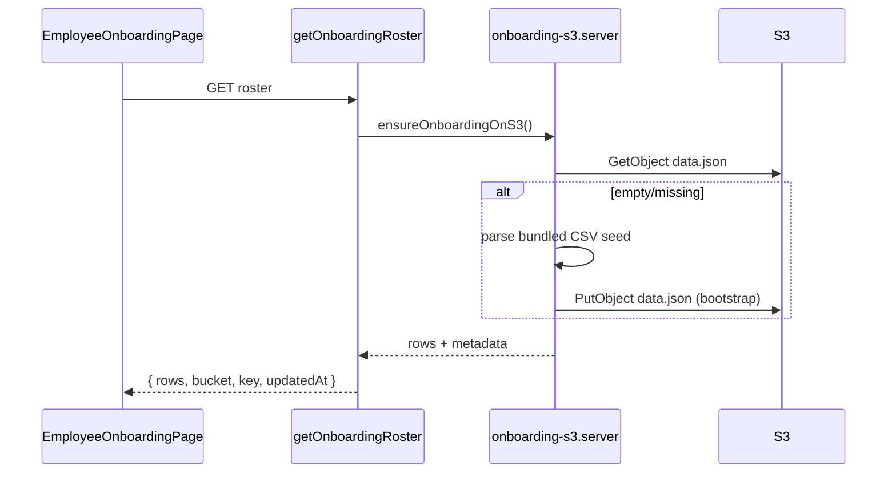
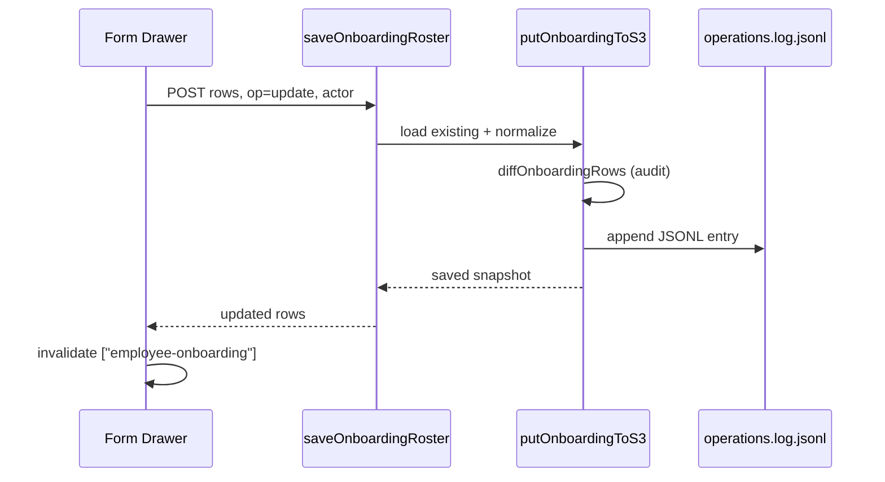

# Employee Onboarding Module Documentation

This document explains the Employee Onboarding module end-to-end:

- architecture and route
- data model and S3 persistence
- read/write flows and audit logging
- org-chart sync behavior
- UI components and permissions
- failure handling and file map

---

## 1) Purpose

The Employee Onboarding module (`/employee-onboarding`) is an HR roster editor for new and in-progress employees. It stores a wide employee profile sheet (identity, employment, compensation, addresses, access, etc.) in **AWS S3** with an **append-only operations log**.

Key characteristics:

- **S3 is canonical** — the UI reads and writes `onboarding/data.json`.
- **Super Admin edits only** — other roles can view the roster.
- **Drawer-based editing** — table cells are read-only; add/edit happens in a form drawer.
- **Org-chart sync** — selected fields can be merged from bundled org-chart CSV seed data.
- **Audit trail** — every mutation appends to `onboarding/operations.log.jsonl`.

Related but separate module: `/boarding` (checklist/workflow boarding UX). Employee Onboarding links to it but owns the roster data layer.

---

## 2) Route Structure

| Item | Value |
|------|-------|
| Route file | `src/routes/employee-onboarding.tsx` |
| Path | `/employee-onboarding` |
| Page component | `EmployeeOnboardingPage` |
| React Query key | `["employee-onboarding"]` |

### Page responsibilities

1. Load roster via `getOnboardingRoster()`.
2. Hold local `rows` state (with dirty-tracking to avoid clobbering in-flight edits).
3. Expose actions: Add user, Sync org chart fields, open Boarding module link.
4. Render `BoardingDataTable` with facet filters and CSV export.
5. Open `OnboardingEmployeeFormDrawer` for add/edit.

---

## 3) Data Model

Schema file: `src/lib/onboarding-schema.ts`

### Row type

Each row is an `OnboardingRow`:

```ts
type OnboardingRow = Record<OnboardingColumn, string> & { _rowId: string };
```

- `_rowId` — stable internal row key (usually same as Employee ID).
- All column values are strings (even numeric/date fields).

### Columns (`ONBOARDING_COLUMNS`)

| Group | Columns |
|-------|---------|
| Identity | Employee ID, Name, Personal Email, Official Email |
| Org | Location, Team, Manager, Employment Status, Job Title, Employment Type |
| Contact | Contact Phone Number, Emergency Contact Phone Number |
| Personal | Age, DOB, Gender, National ID Number |
| Address | Home Address, Permanent Address |
| Compensation | Base Salary, Benefits, Shares/Equity, Shares Awarded Date |
| Ops | HR, Shared, Company Property, Access, Last Woking Date |

### S3 data file shape

```json
{
  "version": 1,
  "updatedAt": "2026-07-02T10:00:00.000Z",
  "rows": [ /* OnboardingRow[] */ ]
}
```

Type: `OnboardingDataFile`

### New row ID generation

`blankOnboardingRow(name)` creates a row with:

- `generateOnboardingEmployeeId(name)` → `onb_{slug}_{timestamp36}`
- Empty strings for all other columns
- `Employee ID` and `_rowId` set to the generated ID

---

## 4) S3 Storage Layout

Implementation: `src/lib/onboarding-s3.server.ts`

### Environment variables

| Variable | Default | Purpose |
|----------|---------|---------|
| `AWS_REGION` / `S3_REGION` | required | S3 client region |
| `AWS_ACCESS_KEY_ID` | required | S3 credentials |
| `AWS_SECRET_ACCESS_KEY` | required | S3 credentials |
| `ALYSON_HR_ORGCHART_S3_BUCKET` | `alyson-hr-orgchart` | Bucket name |
| `ALYSON_HR_ONBOARDING_S3_KEY` | `onboarding/data.json` | Roster snapshot |
| `ALYSON_HR_ONBOARDING_LOG_S3_KEY` | `onboarding/operations.log.jsonl` | Audit log |

### Object paths

```
s3://{bucket}/onboarding/data.json
s3://{bucket}/onboarding/operations.log.jsonl
```

### Bucket bootstrap

`ensureBucketExists(bucket)` runs `HeadBucket` and creates the bucket if missing (with correct region constraint).

---

## 5) Server Function Layer

File: `src/lib/onboarding-functions.ts`

All handlers use TanStack `createServerFn` and validate input with **Zod**.

| Function | Method | Purpose |
|----------|--------|---------|
| `getOnboardingRoster` | GET | Load roster (auto-seed if empty) |
| `saveOnboardingRoster` | POST | Replace snapshot with new rows |
| `addOnboardingUser` | POST | Append one blank row (server-side helper) |
| `deleteOnboardingUser` | POST | Remove row by employee ID |
| `syncOnboardingOrgChartFields` | POST | Merge org-chart fields from seed CSV |

### `getOnboardingRoster`

```
Client → getOnboardingRoster()
      → ensureOnboardingOnS3()
      → getOnboardingFromS3() OR seed from bundled CSV
      → return { rows, updatedAt, bucket, key, logKey }
```

### `saveOnboardingRoster`

Input:

```ts
{
  rows: Record<string, unknown>[];
  op?: "create" | "update" | "bulk_replace";
  employeeId?: string;
  details?: string;
  actor?: string; // Clerk email
}
```

Flow:

1. Load existing snapshot.
2. Normalize rows (`asOnboardingRows` — ensures `_rowId` + `Employee ID`).
3. `putOnboardingToS3(rows, { op, actor, previousRows, ... })`.
4. Return updated rows + metadata.

### `deleteOnboardingUser`

1. Find row by `_rowId` or `Employee ID`.
2. Filter it out of the array.
3. Write snapshot with `op: "delete"` and `deletedRow` in log.

### `syncOnboardingOrgChartFields`

Calls `syncOnboardingOrgChartFieldsFromSeed(actor)`:

1. Load current S3 rows.
2. Merge from bundled org-chart CSV (`BUNDLED_ONBOARDING_ROSTER_CSV`).
3. Only overwrite these fields when seed has a value:
   - `Location`
   - `Team`
   - `Manager`
   - `Employment Status`
4. Match order: **Employee ID** → fallback **Official Email**.
5. Save with `op: "bulk_replace"`.

---

## 6) Read Flow (UI)

```
EmployeeOnboardingPage
  useQuery(["employee-onboarding"], getOnboardingRoster)
    ↓
  rows state ← q.data.rows (unless rowsDirty)
    ↓
  BoardingDataTable(columns, rows, filters, CSV)
```

Local state rules:

- `rowsRef` tracks latest rows for mutation callbacks.
- `rowsDirty` prevents query refetch from overwriting optimistic/local edits mid-save.
- On successful save/delete/sync, `rowsDirty` resets and query invalidates.

---

## 7) Write Flows (UI → S3)

### Add employee

1. Super Admin clicks **Add user**.
2. `blankOnboardingRow()` opens in `OnboardingEmployeeFormDrawer` (`mode: "add"`).
3. On save: prepend row to `rows`, call `saveOnboardingRoster` with `op: "create"`.
4. Toast + invalidate query.

### Edit employee

1. Super Admin clicks row **Edit**.
2. Drawer opens with cloned row (`mode: "edit"`).
3. On save: replace matching `_rowId` in array, `op: "update"`.
4. Server diffs fields for audit log (`onboarding-audit.ts`).

### Delete employee

1. Table delete triggers `onRowsChange` with one fewer row.
2. Detect removed `_rowId`, call `deleteOnboardingUser`.
3. On error: rollback local rows to snapshot.

### Sync org chart fields

1. Super Admin clicks **Sync org chart fields**.
2. `syncOnboardingOrgChartFields({ actor })`.
3. Server merges Location/Team/Manager/Employment Status from seed.
4. UI replaces `rows` with server response.

---

## 8) Audit Logging

File: `src/lib/onboarding-audit.ts`

Every `putOnboardingToS3` call appends one JSONL line via `appendOnboardingLog()`.

### Log entry shape (`OnboardingLogEntry`)

| Field | Description |
|-------|-------------|
| `ts` | ISO timestamp |
| `op` | `bootstrap` \| `create` \| `update` \| `delete` \| `bulk_replace` |
| `actor` | Clerk email of editor |
| `employeeId` / `employeeName` | Target employee |
| `rowCount` | Total rows after write |
| `details` | Human-readable summary |
| `changes` | Field-level diff for single-row update |
| `edits` | Multi-row diff for bulk update |
| `deletedRow` | Full row snapshot on delete |

### Diff logic

`diffOnboardingRows(before, after)` compares all `ONBOARDING_COLUMNS` per matching `_rowId` and builds `OnboardingFieldChange[]` with `from` / `to` values.

Log is **append-only** (read tail + write tail + new line). There is no in-app audit viewer for onboarding today (unlike Leave module); log is stored in S3 for compliance/debugging.

---

## 9) CSV Import/Export

File: `src/lib/onboarding-csv.ts`

### Bootstrap import

On first S3 access, `loadSeedRows()` parses `BUNDLED_ONBOARDING_ROSTER_CSV` via `parseOnboardingCsv()`.

Parser behavior:

- Header row maps to `ONBOARDING_COLUMNS`.
- Skips empty rows.
- Generates `_rowId` from Employee ID, email, or name slug.

### UI export

`BoardingDataTable` supports `enableCsvDownload` with:

- `csvFileNamePrefix="onboarding-roster"`
- `csvColumns={ONBOARDING_COLUMNS}`
- Exports **filtered** table view (respects facet filters).

`serializeOnboardingCsv` / `downloadOnboardingCsv` are also available for programmatic export.

---

## 10) UI Components

### `BoardingDataTable`

File: `src/components/BoardingDataTable.tsx`

- TanStack Table with sorting, facet filters, optional inline edit.
- Employee Onboarding uses:
  - `editable={true}` but `readOnlyCells={true}` (edit via drawer only)
  - `onEditRow` → opens form drawer
  - `onRowsChange` → delete detection
  - Facet filters: Location, Team, Employment Status
  - Delete confirm uses `Name` + `Employee ID`

### `OnboardingEmployeeFormDrawer`

File: `src/components/OnboardingEmployeeFormDrawer.tsx`

Sections:

- **Identity** — ID, name, emails, phones
- **Employment** — location, team, manager, status, title, type
- **Personal** — age, DOB, gender, national ID
- **Addresses** — home, permanent
- **Compensation** — salary, benefits, equity
- **Other** — HR, shared, property, access, dates

Field rendering:

- Date columns → date input (`DOB`, `Shares Awarded Date`, etc.)
- Long text → textarea (addresses, bank, access)
- Requires `Name` before save

---

## 11) Authentication and Permissions

```ts
const canEdit = auth.hasRole("super_admin");
const actor = auth.user?.email ?? null;
```

| Action | Super Admin | Other roles |
|--------|-------------|-------------|
| View roster | Yes | Yes |
| Add / edit / delete | Yes | No (toast: "Super Admin only") |
| Sync org chart fields | Yes | Hidden |
| CSV download | Yes | Yes |

Actor email is passed to server functions for audit log attribution. Server does not currently re-verify Clerk role on every onboarding write (client-gated); hardening would add `clerk-auth.server.ts` checks in handlers.

---

## 12) Integration With Other Modules

| Module | Relationship |
|--------|--------------|
| `/boarding` | Linked from page header; separate checklist/workflow UX |
| `/team` | Org chart roster sync; shared employee identity concepts |
| Leave (legacy) | Leave roster previously referenced onboarding; now primarily Time Doctor |
| Org chart S3 | Same bucket (`alyson-hr-orgchart`); onboarding sync reads bundled CSV aligned with org chart sheet |

Onboarding is the **authoritative wide employee profile sheet** for HR onboarding data. Other modules should read from S3 or server functions rather than duplicating row shape.

---

## 13) Caching and Consistency

- React Query `staleTime`: default (refetch on window focus/mount).
- `rowsDirty` guard prevents race between local edits and refetch.
- Every write is a **full snapshot replace** of `data.json` (not partial PATCH).
- No optimistic concurrency (ETag) on onboarding S3 — last write wins.

---

## 14) Failure and Recovery

| Failure | Behavior |
|---------|----------|
| Missing AWS env | Server throws `Missing AWS_* (required for S3)` |
| S3 object missing | Auto-bootstrap from bundled CSV |
| Save mutation error | Toast error; rows may stay dirty until retry |
| Delete mutation error | Local rows rolled back to pre-delete snapshot |
| Employee not found on delete | Server throws `Employee not found` |

---

## 15) File Map

| File | Role |
|------|------|
| `src/routes/employee-onboarding.tsx` | Page, mutations, table wiring |
| `src/lib/onboarding-functions.ts` | TanStack server function API |
| `src/lib/onboarding-s3.server.ts` | S3 read/write, bootstrap, org-chart merge |
| `src/lib/onboarding-schema.ts` | Types, columns, blank row helper |
| `src/lib/onboarding-csv.ts` | CSV parse/serialize/export |
| `src/lib/onboarding-audit.ts` | Field diff + log summaries |
| `src/lib/bundled-data.ts` | `BUNDLED_ONBOARDING_ROSTER_CSV` seed |
| `src/components/BoardingDataTable.tsx` | Shared data table |
| `src/components/OnboardingEmployeeFormDrawer.tsx` | Add/edit form drawer |

---

## 16) Sequence Diagrams

### Initial page load



### Edit and persist



---

## 17) Migration Notes (for Palisade merge)

When porting this module to another repo:

1. **Keep** `onboarding-schema.ts`, `onboarding-s3.server.ts`, `onboarding-csv.ts`, `onboarding-audit.ts`.
2. **Adapt** `onboarding-functions.ts` to target API style (Next route handlers if no TanStack Start).
3. **Rebuild** page UI with target design system; keep S3 key paths or migrate data deliberately.
4. **Preserve** audit log format if compliance history matters.
5. **Temporarily** allow superadmin-only edits until role model is finalized in target app.
