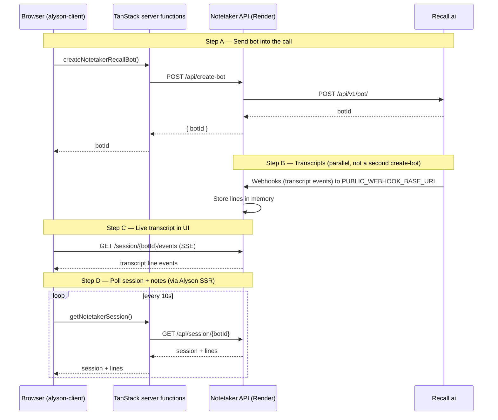

# Alyson Notetaker — Architecture & API Flow

This document describes how the **Alyson HR client** (`alyson-client`) integrates with the **notetaker backend** and **Recall.ai**. The notetaker backend is a **separate service** (deployed at `https://api-uic1.onrender.com` in production); its source code is **not** in this repository.

---

## 1. High-level picture

There are **three runtimes**, not one:

| Layer | What it is | Typical URL (your setup) |
|-------|------------|---------------------------|
| **Alyson client** | TanStack Start UI + server functions | `http://localhost:3001` (dev) |
| **Notetaker API** | Node service: Recall proxy, webhooks, in-memory sessions, SSE | `https://api-uic1.onrender.com` |
| **Recall.ai** | Meeting bot + recording + transcription | `https://{RECALL_REGION}.recall.ai` |

When you click **Create**, you are **not** calling Recall from the browser. You call Alyson’s server, which calls the notetaker API, which calls Recall.

Transcripts use **two paths**:

1. **Recall → webhooks → notetaker API** (server-to-server; stores lines)
2. **Browser → SSE on notetaker API** (live display while the meeting runs)

---

## 2. End-to-end sequence



---

## 3. Are we hitting multiple API endpoints?

**Yes — but for different jobs.**

| # | When | Who calls whom | HTTP | Purpose |
|---|------|----------------|------|---------|
| 1 | Create bot | Alyson SSR → Notetaker | `POST /api/create-bot` | Join meeting |
| 2 | (internal) | Notetaker → Recall | `POST /api/v1/bot/` | Recall creates bot |
| 3 | During meeting | Recall → Notetaker | Webhook `POST` (path configured on notetaker) | Push transcript/status events |
| 4 | During meeting | Browser → Notetaker | `GET /session/{botId}/events` | Live transcript (SSE) |
| 5 | During/after | Alyson SSR → Notetaker | `GET /api/session/{botId}` | Session metadata + stored lines |
| 6 | Optional | Alyson SSR → Notetaker | `POST /api/session/{botId}/notes` | Generate notes (Groq) |
| 7 | Optional | Alyson SSR → S3 | (AWS SDK) | Persist transcript/notes to S3 |

**Important:** Transcripts are **not** fetched by a second Recall “create bot” call. Recall **pushes** data to your deployed notetaker URL; the UI **pulls** via SSE and polling.

---

## 4. Recall billing (two usage types)

On Recall’s pay-as-you-go plan (see [recall.ai/pricing](https://www.recall.ai/pricing)):

| Charge | What triggers it | Rough rate |
|--------|------------------|------------|
| **Recording** | Bot in call / recording hours | ~$0.50 / hour (prorated) |
| **Built-in transcription** | Transcription enabled on the bot | +$0.15 / hour on top |

Third-party STT (Deepgram, etc.) is billed by that provider, not the +$0.15 Recall line item.

---

## 5. Environment variables

Configured in **`.env`** at repo root (loaded via `dotenv` in `package.json` scripts).

| Variable | Used by | Purpose |
|----------|---------|---------|
| `RECALL_API_KEY` | **Notetaker service** (must be set on Render too) | Recall `Authorization: Token …` |
| `RECALL_REGION` | Notetaker | `us-west-2`, `us-east-1`, `eu-central-1`, `ap-northeast-1` |
| `PUBLIC_WEBHOOK_BASE_URL` | Notetaker | Public base URL Recall calls for webhooks (no trailing slash) |
| `RECALL_VERIFICATION_SECRET` | Notetaker | `whsec_…` — verify webhook signatures (optional but recommended) |
| `ALYSON_NOTETAKER_BASE_URL` | Alyson **server** functions | Proxy target (defaults to `http://localhost:3003`) |
| `VITE_ALYSON_NOTETAKER_BASE_URL` | Browser (SSE) + server if `ALYSON_*` unset | Same notetaker base URL |
| `GROQ_API_KEY` / `GROQ_MODEL` | Notetaker (notes) | AI meeting notes |

**Production note:** Changing `.env` in `alyson-client` does **not** update Recall credentials on Render. Update env vars on the **Render** service and redeploy.

---

## 6. Repository layout — `alyson-client`

### 6.1 UI routes (`src/routes/alyson-notetaker/`)

| File | Route | Role |
|------|-------|------|
| `route.tsx` | `/alyson-notetaker` | Layout wrapper (`<Outlet />`) |
| `index.tsx` | `/alyson-notetaker/` | Main page: session list, **CreateBotForm**, **SessionPanel**, notes, chat, persist |
| `calendar.tsx` | `/alyson-notetaker/calendar` | Meeting calendar (S3-backed sessions) |
| `analytics.tsx` | `/alyson-notetaker/analytics` | Speaker analytics from S3 transcripts |

**Key UI components (all in `index.tsx`):**

- `AlysonNotetakerPage` — loads sessions, super-admin gate
- `CreateBotForm` — calls `createNotetakerRecallBot` (~line 378)
- `SessionPanel` — SSE live transcript (~line 527), polls `getNotetakerSession` every 10s

**Static asset for bot avatar:**

- `public/images/alyson-mini.svg` — converted to JPEG base64 in `CreateBotForm`

### 6.2 Server functions — notetaker proxy (`src/lib/`)

| File | Exports / role |
|------|----------------|
| `alyson-notetaker-functions.ts` | `listNotetakerSessions`, `createNotetakerRecallBot`, `generateNotetakerNotes`, `finalizeNotetakerSession`; `upstream()` HTTP helper; types `NotetakerSession`, `NotetakerTranscriptLine` |
| `notetaker-get-session-functions.ts` | `getNotetakerSession` — proxies `GET /api/session/:botId`, S3/local fallbacks |
| `notetaker-persistence-functions.ts` | `finalizeAndPersistNotetakerSession` — manual persist to S3 |
| `notetaker-sessions-s3-functions.ts` | `syncNotetakerSessionsIndexToS3` |
| `notetaker-delete-functions.ts` | `deleteNotetakerSessionFromS3` |
| `notetaker-calendar-functions.ts` | Calendar data from S3 |
| `notetaker-analytics-functions.ts` | Analytics API for UI |
| `notetaker-smart-notes.ts` | Client-side smart notes helper |
| `notetaker-datastore-functions.ts` | Thin wrappers around local datastore (if used) |

### 6.3 Server-only persistence & S3 (`src/lib/*.server.ts`)

| File | Role |
|------|------|
| `notetaker-datastore.server.ts` | Local JSON under `.alyson/notetaker-db/sessions/` |
| `notetaker-auto-persist.server.ts` | Auto-write ended meetings to S3 |
| `notetaker-persistence.server.ts` | S3 write helpers for transcripts/notes |
| `notetaker-sessions-history.server.ts` | Merge/list sessions from S3 |
| `notetaker-sessions-s3.server.ts` | S3 session index |
| `notetaker-s3-calendar.server.ts` | Calendar objects in S3 |
| `notetaker-s3-delete.server.ts` | Delete S3 session artifacts |
| `notetaker-transcript-parse.server.ts` | Parse transcript text formats |
| `notetaker-analytics.server.ts` | Analytics aggregation |
| `notetaker-analytics-insights.server.ts` | LLM insights for analytics |
| `notetaker-analytics-session.ts` | Per-session analytics types/helpers |

### 6.4 Scripts

| File | Role |
|------|------|
| `scripts/notetaker_analytics_crawler.py` | Offline S3 transcript crawler for analytics |

### 6.5 Shared components used by notetaker UI

| File | Role |
|------|------|
| `src/components/AppShell.tsx` | `PageHeader`, layout |
| `src/components/Skeleton.tsx` | `PageSkeleton` loading state |
| `src/lib/mini-module-ai.ts` | In-meeting chat over transcript context |
| `src/lib/auth.tsx` | Super-admin role gate |

---

## 7. Code map — Create bot flow

```
User clicks "Create"
  └─ src/routes/alyson-notetaker/index.tsx
       └─ CreateBotForm → createNotetakerRecallBot({ data: { meeting_url, bot_name, title, avatar_jpeg_b64? } })
            └─ src/lib/alyson-notetaker-functions.ts
                 └─ upstream("POST", "/api/create-bot", JSON body)
                      └─ {ALYSON_NOTETAKER_BASE_URL || VITE_ALYSON_NOTETAKER_BASE_URL || localhost:3003}
                           └─ Notetaker service → Recall POST /api/v1/bot/
                                └─ Returns { botId } to UI
```

---

## 8. Code map — Transcript flow

```
Recall (during meeting)
  └─ POST webhook → https://api-uic1.onrender.com/...  (path defined in notetaker repo, not alyson-client)
       └─ Notetaker stores transcript lines (in-memory)
            ├─ Browser: EventSource GET /session/{botId}/events
            │    └─ src/routes/alyson-notetaker/index.tsx (SessionPanel, ~line 527)
            └─ Alyson SSR: getNotetakerSession every 10s
                 └─ src/lib/notetaker-get-session-functions.ts
                      └─ GET /api/session/{botId} on notetaker
```

**Merging in UI:** `SessionPanel` combines polled lines (`q.data.lines`) + SSE lines (`live` state) in `mergedLines`.

---

## 9. Notetaker HTTP API (external service)

These routes are implemented by the **notetaker backend** (Render). This repo only **calls** them.

| Method | Path | Called from (alyson-client) |
|--------|------|-----------------------------|
| `POST` | `/api/create-bot` | `createNotetakerRecallBot` in `alyson-notetaker-functions.ts` |
| `GET` | `/api/sessions` | `listNotetakerSessions` in `alyson-notetaker-functions.ts` |
| `GET` | `/api/session/:botId` | `getNotetakerSession` in `notetaker-get-session-functions.ts` |
| `GET` | `/session/:botId/events` | **Browser only** — `index.tsx` `SessionPanel` (SSE) |
| `POST` | `/api/session/:botId/notes` | `generateNotetakerNotes` in `alyson-notetaker-functions.ts` |

Recall’s own API (called **only by notetaker**):

| Method | Recall URL |
|--------|------------|
| `POST` | `https://{RECALL_REGION}.recall.ai/api/v1/bot/` |

---

## 10. Persistence after the meeting

| Trigger | Code | Storage |
|---------|------|---------|
| Meeting ended (auto) | `notetaker-auto-persist.server.ts` via `getNotetakerSession` | S3 prefix `alyson-notetaker/transcripts/`, `meetingnotes/` |
| User clicks Persist | `finalizeAndPersistNotetakerSession` in `notetaker-persistence-functions.ts` | Same S3 layout |
| Local dev fallback | `notetaker-datastore.server.ts` | `.alyson/notetaker-db/sessions/{botId}.json` |

---

## 11. Local development

| Command | What it does |
|---------|----------------|
| `npm run dev` | Alyson UI on port **3001** (reads `.env`) |
| `npm run dev:ops` | Same + forces notetaker URLs to `http://localhost:3003` |

You must also run the **notetaker service** (separate repo/process) on port **3003** (or point env at Render).

**SSE pitfall:** If `VITE_ALYSON_NOTETAKER_BASE_URL` is unset, `SessionPanel` defaults SSE to `http://localhost:3002` while server functions default to `3003`. Keep both env vars aligned.

---

## 12. What is *not* in this repo

- Notetaker Express/Fastify (or similar) server
- Recall webhook route handlers
- `RECALL_API_KEY` usage at runtime (keys in `.env` are for local notetaker / documentation; production keys live on **Render**)

For webhook verification (`whsec_…`), set `RECALL_VERIFICATION_SECRET` on the **notetaker** deployment, not only in this client’s `.env`.

---

## 13. Related docs

- Shorter overview: [README.md § Alyson Notetaker](./README.md#alyson-notetaker--create-bot-flow)
- Org chart / HR: [orgchart.md](./orgchart.md), [boarding.md](./boarding.md)
