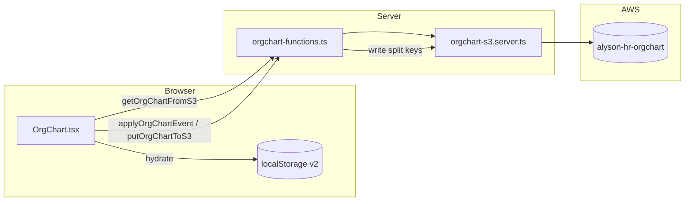

<div align="center">

# Alyson Org Chart

**People, reporting lines, and drift-proof history — in one canvas.**

*React Flow · TanStack Start · Amazon S3 · local-first cache*

</div>

---

## At a glance

| Layer | Role |
|------|------|
| **UI** | `OrgChart` — search, highlight chain, edit mode, drag nodes, connect handles, break link, terminate (type-to-confirm), add dummy people |
| **Draft state** | Manager overrides, terminations list, added people, node positions — merged with HR overview / Supabase employees for display |
| **Browser cache** | `localStorage` key `alyson-orgchart-layout-v2` — instant paint, survives refresh if cloud is down |
| **Cloud source of truth** | S3 bucket `alyson-hr-orgchart` — isolated JSON “directories” + immutable per-event audit files |

---

## Visual map of the bucket

Everything lives under one bucket (override with env — see below):

```
s3://alyson-hr-orgchart/
│
├── main/
│   └── state.json                 ← live graph: canvas positions + manager edges (overrides)
│
├── terminations/
│   └── index.json                 ← every person removed from the chart (with timestamps)
│
├── additions/
│   └── index.json                 ← synthetic / dummy people you added in edit mode
│
└── logs/
    ├── index.json                 ← FULL append-only event log (no rolling cap)
    └── by-date/
        └── YYYY-MM-DD/
            └── <event-uuid>.json  ← one immutable file per event (forensic copy)
```

> **Reset behaviour:** “Reset draft” clears `main/`, `terminations/`, and `additions/` back to empty and writes a `reset` event. Historical files under `logs/by-date/**` are **never deleted** — your audit trail survives resets.

---

## Environment variables

| Variable | Default | Purpose |
|---------|---------|---------|
| `ALYSON_HR_ORGCHART_S3_BUCKET` | `alyson-hr-orgchart` | Target bucket name |
| `AWS_REGION` | — | Region for `S3Client` (alias: `S3_REGION`) |
| `AWS_ACCESS_KEY_ID` | — | IAM access key with `s3:PutObject`, `s3:GetObject`, `s3:HeadBucket`, `s3:CreateBucket` |
| `AWS_SECRET_ACCESS_KEY` | — | Secret for the key above |

Object keys under the bucket are **fixed** (see tree above): there is no separate `ALYSON_HR_ORGCHART_S3_KEY` for the split layout — paths are defined in `ORGCHART_KEYS` in `orgchart-s3.server.ts`.

The bucket is **auto-created** on first write if it does not exist (same pattern as other Alyson S3 modules).

---

## Source files (where to look in the repo)

| Path | Responsibility |
|------|----------------|
| `src/components/OrgChart.tsx` | UI, React Flow, modals, sync pill, `localStorage` cache, calls server fns |
| `src/lib/orgchart-s3.server.ts` | S3 read/write, key layout, merge of four objects into one logical snapshot |
| `src/lib/orgchart-functions.ts` | `createServerFn` wrappers: `getOrgChartFromS3`, `applyOrgChartEvent`, `putOrgChartToS3`, `resetOrgChartOnS3` |

---

## Logical schema: `OrgChartSnapshot`

The React app and server functions speak a **single merged view** for convenience. Under the hood S3 stores it split across keys — but the shape is:

```ts
type OrgChartSnapshot = {
  version: 1;                              // schema version — bump if you migrate data
  updatedAt: string;                       // ISO-8601 — max of touched parts on read
  positions: Record<string, { x: number; y: number }>;
  managerOverrides: Record<string, string | null>;
  terminated: OrgChartTerminationRecord[];
  added: EmployeeFull[];
  events: OrgChartAuditEvent[];
};
```

### `positions`

| Field | Type | Meaning |
|-------|------|---------|
| Key | `employeeId` | UUID from Supabase or `dummy-*` id for synthetic rows |
| Value | `{ x, y }` | React Flow node position in pixels |

### `managerOverrides`

| Field | Type | Meaning |
|-------|------|---------|
| Key | `employeeId` | The **report** (child) |
| Value | `string \| null` | Their **manager’s** employee id, or `null` = root (no manager) |

Overrides sit on top of each row’s canonical `manager_id` from the HR dataset. If a key is absent, the canonical value wins.

### `terminated[]` — `OrgChartTerminationRecord`

| Field | Type | Notes |
|-------|------|-------|
| `employeeId` | `string` | Who left the chart |
| `fullName` | `string` | Snapshot of display name at termination time |
| `role` | `string \| null` | |
| `departmentName` | `string \| null` | |
| `isDummy` | `boolean` | `true` when id starts with `dummy-` |
| `terminatedAt` | `string` | ISO-8601 |
| `previousManagerId` | `string \| null` | Manager before removal |
| `reparentedToManagerId` | `string \| null` | Direct reports were moved under this manager |
| `reason` | `string \| null` | Reserved for future HRIS codes |

### `added[]` — `EmployeeFull`

Same shape as `src/lib/queries.ts` → `EmployeeFull` (employee row + `department_name`, `total_comp`, etc.). Dummy users get:

- `id`: `dummy-<uuid>`
- `email`: `<slug>@dummy.local`

### `events[]` — `OrgChartAuditEvent`

| Field | Type | Meaning |
|-------|------|---------|
| `id` | `string` | UUID — also the filename stem under `logs/by-date/` |
| `at` | `string` | ISO-8601 event time |
| `type` | union below | High-level category |
| `payload` | `Record<string, any>` | Free-form JSON — see event catalogue |

#### Event `type` union

```
manager_change | terminate | add_person | positions_saved | reset | publish
```

---

## On-disk file schemas (per S3 key)

### `main/state.json`

```json
{
  "version": 1,
  "updatedAt": "2026-05-12T12:00:00.000Z",
  "positions": { "uuid-…": { "x": 120, "y": 280 } },
  "managerOverrides": { "uuid-child": "uuid-manager" }
}
```

Written when positions or manager overrides change.

### `terminations/index.json`

```json
{
  "version": 1,
  "updatedAt": "2026-05-12T12:00:00.000Z",
  "records": [ /* OrgChartTerminationRecord[] */ ]
}
```

### `additions/index.json`

```json
{
  "version": 1,
  "updatedAt": "2026-05-12T12:00:00.000Z",
  "people": [ /* EmployeeFull[] */ ]
}
```

### `logs/index.json`

```json
{
  "version": 1,
  "updatedAt": "2026-05-12T12:00:00.000Z",
  "events": [ /* OrgChartAuditEvent[] — complete history, grows without cap */ ]
}
```

### `logs/by-date/YYYY-MM-DD/<eventId>.json`

Exact copy of a single `OrgChartAuditEvent` object — **immutable** once written.

---

## Event catalogue (payloads)

These are appended on every user-visible action. Payloads are best-effort and may evolve — treat unknown keys as forward-compatible.

| `type` | When it fires | Typical `payload` keys |
|--------|----------------|------------------------|
| `manager_change` | Break link pill OR drag-connect new edge | `kind`: `"break"` \| `"connect"`, `employeeId`, `employeeName`, `previousManagerId`, `newManagerId`, `newManagerName` |
| `terminate` | Confirm terminate modal | Spread of `OrgChartTerminationRecord` + `reparentedFromIds` (child ids that were reparented) |
| `add_person` | Add dummy modal submit | `employeeId`, `fullName`, `role`, `departmentName`, `managerId`, `isDummy` |
| `positions_saved` | Toolbar “Save layout” | `nodeCount` |
| `publish` | Toolbar “Publish” | `nodeCount` |
| `reset` | Toolbar reset (↺) after confirm | `resetAt`, `previousCounts` (object counts before wipe) |

---

## Data flow diagram



---

## Server API surface

| Function | HTTP | Input (Zod) | Effect |
|----------|------|-------------|--------|
| `getOrgChartFromS3` | GET | — | Reads all four prefixes, merges into `OrgChartSnapshot` |
| `applyOrgChartEvent` | POST | Partial snapshot + mandatory `event` | Merges with existing, writes only changed prefixes, always appends log |
| `putOrgChartToS3` | POST | Full snapshot + optional `event` | Full replace of main/terminations/additions (+ log if event) |
| `resetOrgChartOnS3` | POST | — | Clears main + terminations + additions, logs `reset` |

---

## Browser cache (`localStorage`)

| Key | Value shape |
|-----|-------------|
| `alyson-orgchart-layout-v2` | `{ positions, managerOverrides, terminations, added }` — mirrors cloud minus the event log (events only live server-side) |

On mount: cache is applied immediately, then S3 overwrites React state when the network round-trip completes.

---

## Toolbar UX reference

| Control | Cloud impact |
|---------|----------------|
| Sync pill | `loading` → `saving` → `synced` / `error` / `offline` |
| Edit org | Enables drag + connect + break + terminate + add person |
| Add person | `add_person` event + `additions/index.json` |
| Save layout | `positions_saved` + full `putOrgChartToS3` |
| Publish | `publish` via `applyOrgChartEvent` |
| Reset (↺) | `resetOrgChartOnS3` — clears draft slices, preserves `logs/by-date/**` |

---

## Layout algorithm (high level)

1. Build a `children` map: each employee → effective manager via `getManagerId(emp, overrides)`.
2. Skip manager ids that do not exist in the current employee set (stale references after termination).
3. Depth-first placement: parent centered over subtree; edges drawn manager → report.
4. Saved `positions` overlay wins over auto-layout when a key exists for that node id.

---

## Troubleshooting

| Symptom | Likely cause |
|---------|----------------|
| Sync pill stuck on “Offline” | Missing / wrong AWS env vars, or bucket policy denies access |
| “Cloud save failed” toast | Network blip or IAM permission — local cache still has your edit |
| Node flies back after refresh | S3 write never succeeded — check browser network tab for 500 on server fn |
| Duplicate people | Same id in both Supabase overview and `additions` — dedupe prefers first occurrence |

---

## Future ideas (not implemented)

- Paginated reader for `logs/index.json` when it grows past browser-friendly sizes
- Glacier lifecycle rule on `logs/by-date/**` for cost control
- Mirror `create_user` (admin drawer) events into the same log stream

---

<div align="center">

**Built for operators who need the org to be both flexible and provable.**

*Last reviewed against codebase: May 2026*

</div>
